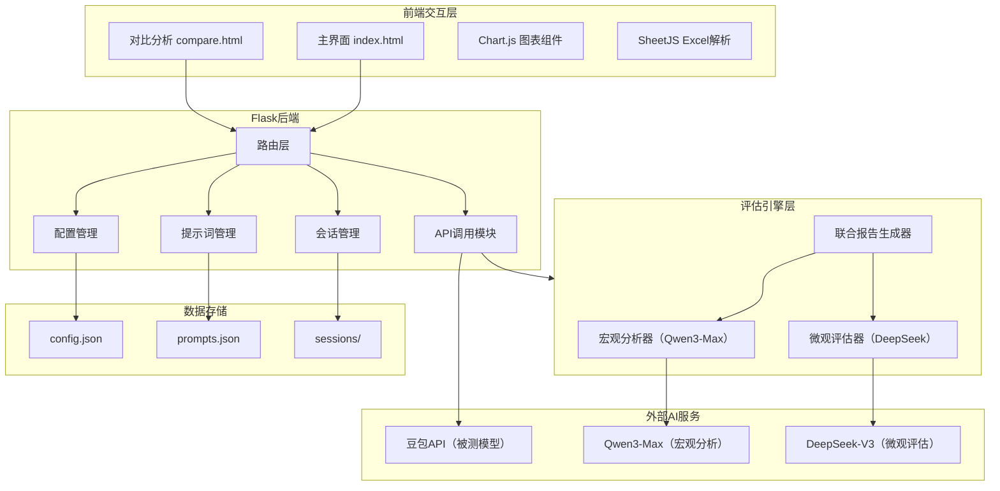
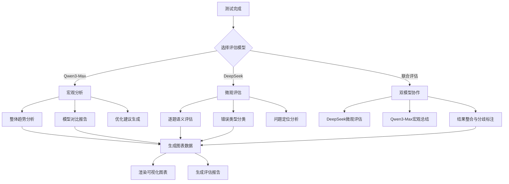

# Design Document

## Overview

AI批改效果分析平台基于现有Flask后端 + 原生HTML/CSS/JavaScript前端架构进行扩展。现有系统已实现主界面（index.html）的实时模型测试和对比分析界面（compare.html）的单图测试、批量对比、一致性测试功能。本次设计在现有基础上新增学科分类评估、自定义模型配置保存、智能问题诊断等功能。

### 现有功能（已实现）
- 主界面：多模型选择、流式响应、全部对比、会话上下文、深度思考模式
- 对比分析：单图并行测试、批量Excel对比、一致性测试
- 辅助功能：题号识别、提示词模板管理、API配置

### 新增功能（待开发）
- 学科分类评估：学科/题型选择、评分规则配置
- 自定义模型配置：模型配置保存/切换/管理
- 智能问题诊断：错误分析、改进建议、趋势对比
- **评估模型分工架构**：Qwen3-Max负责宏观分析，DeepSeek负责微观评估
- **联合评估报告**：整合两个评估模型的结果生成综合报告
- **统一AI评估功能**：所有测试模式（单图/批量/一致性/多模型）都支持AI评估
- **LLM问题定位**：调用DeepSeek标注错误类型和定位问题题目
- **可视化图表增强**：柱状图、折线图、饼图、热力图、雷达图、箱线图等
- **DeepSeek评估报告**：自动生成结构化评估报告，支持多格式导出
- **自动题型识别**：根据规则或AI模型自动判断题目类型

## Architecture



## AI评估详细设计

### 1. AI评估流程



### 2. AI评估Prompt模板

#### 2.1 Qwen3-Max 宏观分析Prompt

```
你是AI批改效果分析专家。请对以下测试数据进行宏观分析：

【测试数据摘要】
- 测试类型：{test_type}
- 测试模型：{models}
- 学科：{subject}
- 题型：{question_type}
- 总题数：{total_questions}
- 整体准确率：{overall_accuracy}%
- 各模型准确率：{model_accuracies}
- 错误类型分布：{error_distribution}

请提供以下分析（JSON格式输出）：
1. summary: 整体评估总结（100字以内）
2. model_comparison: 各模型优劣势对比
3. trend_analysis: 数据趋势分析
4. recommendations: 优化建议（提示词优化、模型选择、参数调整）
5. chart_insights: 图表数据解读建议
```

#### 2.2 DeepSeek 语义评估Prompt

```
你是AI批改质量评估专家。请对以下题目的批改结果进行语义级评估：

【题目信息】
- 题号：{index}
- 学科：{subject}
- 题型：{question_type}
- 标准答案：{standard_answer}
- AI批改答案：{ai_answer}
- 字符串匹配结果：{string_match}

请评估并返回JSON格式结果：
{
  "semantic_correct": true/false,  // 语义是否正确
  "score": 0.0-1.0,               // 得分（0-1）
  "missing_points": [],           // 缺失的要点
  "error_type": "识别不准确|规则有误|格式错误|计算错误|选项混淆|无错误",
  "error_stage": "视觉识别|语义理解|推理计算|格式输出|无",
  "severity": "高|中|低|无",
  "confidence": 0.0-1.0,
  "explanation": "详细说明",
  "fix_suggestion": "修复建议"
}
```

#### 2.3 DeepSeek 问题定位Prompt

```
你是AI批改问题诊断专家。请分析以下批改错误并定位问题：

【错误题目列表】
{error_questions}

请返回JSON格式的问题定位结果：
{
  "total_errors": 数量,
  "error_types": { "类型": 数量 },
  "problem_questions": [
    {
      "index": "题号",
      "error_type": "错误类型",
      "standard_answer": "标准答案",
      "user_answer": "AI答案",
      "error_reason": "错误原因分析",
      "fix_suggestion": "修复建议"
    }
  ],
  "pattern_analysis": "错误模式分析",
  "root_causes": ["根本原因1", "根本原因2"]
}
```

### 3. 可视化图表数据生成

#### 3.1 图表类型与数据源映射

| 图表类型 | 数据源 | 用途 |
|---------|--------|------|
| 柱状图-多模型对比 | model_stats | 展示各模型准确率、一致性对比 |
| 折线图-批次耗时 | batch_times | 展示批次耗时变化趋势 |
| 饼图-错误类型 | error_types | 展示错误类型分布占比 |
| 热力图-评分偏差 | score_matrix | 展示模型×题目的评分偏差 |
| 折线图-准确率 | accuracy_trend | 展示准确率变化趋势 |
| 箱线图-模型耗时 | time_distribution | 展示各模型耗时分布 |
| 条形图-Token使用 | token_usage | 展示各模型Token消耗 |
| 雷达图-模型能力 | capability_scores | 展示多维度能力对比 |
| 热力图-模型×学科×题型 | support_matrix | 展示模型对不同学科题型的支持度 |

#### 3.2 图表数据生成逻辑

```javascript
// 多模型对比柱状图数据生成
function generateMultiModelBarData(modelStats) {
  return {
    labels: Object.keys(modelStats),
    datasets: [
      {
        label: '准确率',
        data: Object.values(modelStats).map(s => s.accuracy),
        backgroundColor: '#1d6f8c'
      },
      {
        label: '一致性',
        data: Object.values(modelStats).map(s => s.consistency),
        backgroundColor: '#2196f3'
      }
    ]
  };
}

// 错误类型饼图数据生成
function generateErrorTypePieData(errorTypes) {
  const colors = ['#ff6384', '#36a2eb', '#ffce56', '#4bc0c0', '#9966ff'];
  return {
    labels: Object.keys(errorTypes),
    datasets: [{
      data: Object.values(errorTypes),
      backgroundColor: colors.slice(0, Object.keys(errorTypes).length)
    }]
  };
}

// 模型能力雷达图数据生成
function generateCapabilityRadarData(models, metrics) {
  return {
    labels: ['准确性', '一致性', '速度', '成本效益', '稳定性'],
    datasets: models.map((model, i) => ({
      label: model.name,
      data: [
        model.accuracy,
        model.consistency,
        100 - (model.avgTime / 10 * 100),  // 速度得分
        100 - (model.tokenCost / 0.1 * 100), // 成本得分
        model.stability
      ],
      borderColor: ['#1d6f8c', '#2196f3', '#ff9800', '#4caf50'][i % 4]
    }))
  };
}

// 热力图数据生成（模型×学科×题型）
function generateHeatmapData(evaluationData) {
  const models = [...new Set(evaluationData.map(d => d.model))];
  const subjects = [...new Set(evaluationData.map(d => d.subject))];
  const types = [...new Set(evaluationData.map(d => d.questionType))];
  
  const matrix = {};
  models.forEach(model => {
    matrix[model] = {};
    subjects.forEach(subject => {
      matrix[model][subject] = {};
      types.forEach(type => {
        const filtered = evaluationData.filter(d => 
          d.model === model && d.subject === subject && d.questionType === type
        );
        matrix[model][subject][type] = filtered.length > 0 
          ? Math.round(filtered.reduce((sum, d) => sum + d.accuracy, 0) / filtered.length)
          : null;
      });
    });
  });
  
  return { models, subjects, types, matrix };
}
```

### 4. 评估报告结构

```
评估报告
├── 一、评估背景
│   ├── 测试目的
│   ├── 测试时间
│   ├── 测试范围（学科、题型、模型）
│   └── 数据规模（题目数、批次数）
│
├── 二、配置信息
│   ├── 使用的模型列表
│   ├── 评估维度配置
│   └── 阈值设置
│
├── 三、核心数据
│   ├── 整体准确率（与阈值对比）
│   ├── 各模型准确率排名
│   ├── 一致性指标
│   ├── 平均耗时
│   ├── Token消耗与成本
│   └── 可视化图表
│       ├── 多模型对比柱状图
│       ├── 准确率折线图
│       ├── 错误类型饼图
│       ├── 模型能力雷达图
│       └── 热力图
│
├── 四、问题分析
│   ├── 错误类型分布
│   ├── 问题题目列表（含详细分析）
│   ├── 错误原因归类
│   └── 错误模式识别
│
└── 五、优化建议
    ├── 提示词优化建议
    ├── 模型选择建议
    ├── 参数调整建议
    └── 后续测试建议
```

## Components and Interfaces

### 1. 后端API接口

#### 现有接口（app.py已实现）

| 接口 | 方法 | 功能 | 状态 |
|------|------|------|------|
| `/` | GET | 渲染主界面 | ✅已实现 |
| `/compare` | GET | 渲染对比分析界面 | ✅已实现 |
| `/api/config` | GET/POST | 获取/保存API配置 | ✅已实现 |
| `/api/prompts` | GET/POST/DELETE | 提示词模板CRUD | ✅已实现 |
| `/api/session` | POST/DELETE | 创建/清除会话 | ✅已实现 |
| `/api/session/<id>` | GET | 获取会话历史 | ✅已实现 |
| `/api/analyze` | POST | 调用AI模型分析（支持流式） | ✅已实现 |
| `/api/extract-questions` | POST | 题号识别 | ✅已实现 |
| `/api/qwen-summary` | POST | 智能分析总结 | ✅已实现 |

#### 新增接口（待开发）

| 接口 | 方法 | 功能 |
|------|------|------|
| `/api/models` | GET/POST/PUT/DELETE | 自定义模型配置管理 |
| `/api/subjects` | GET/POST/PUT | 学科评估规则配置 |
| `/api/diagnose` | POST | 问题诊断分析 |
| `/api/evaluations` | GET/POST/DELETE | 评估记录保存与查询 |
| `/api/favorites` | GET/POST/DELETE | 收藏管理 |
| `/api/export` | POST | 导出测试结果（Excel/PDF/JSON） |
| `/api/qwen/macro-analysis` | POST | Qwen3-Max宏观分析（整体报告、趋势、选型建议） |
| `/api/qwen/compare-report` | POST | Qwen3-Max多模型对比分析报告 |
| `/api/qwen/optimization-advice` | POST | Qwen3-Max提示词优化建议 |
| `/api/deepseek/semantic-eval` | POST | DeepSeek语义评估（逐题正确性判断） |
| `/api/deepseek/judge` | POST | DeepSeek模型仲裁（多模型输出质量评分） |
| `/api/deepseek/diagnose` | POST | DeepSeek错误归因分析（错误原因定位） |
| `/api/eval/joint-report` | POST | 联合评估报告（整合Qwen3-Max和DeepSeek结果） |
| `/api/prompts/ab-test` | POST | 提示词A/B测试 |
| `/api/prompts/versions` | GET | 提示词版本历史 |
| `/api/prompts/rollback` | POST | 提示词版本回滚 |
| `/api/recommend` | POST | 智能模型推荐 |
| `/api/ai-eval/unified` | POST | 统一AI评估入口（支持所有测试模式） |
| `/api/ai-eval/quantify` | POST | 量化数据输出（数值、排名、阈值对比） |
| `/api/ai-eval/problem-locate` | POST | LLM问题定位（错误类型标注、题目定位） |
| `/api/ai-eval/charts` | POST | 生成可视化图表数据 |
| `/api/deepseek/report` | POST | DeepSeek生成结构化评估报告 |
| `/api/export/report` | POST | 导出评估报告（HTML/PDF/Markdown） |
| `/api/question-type/detect` | POST | 自动题型识别 |
| `/api/eval-config` | GET/POST | 自定义评估配置管理 |

### 2. 前端组件结构

```
templates/
├── index.html          # 主界面（已实现）
│   ├── Navbar          # 顶部导航栏 ✅
│   ├── Sidebar         # 侧边栏（题号识别、提示词模板）✅
│   ├── PreviewArea     # 图片预览区 ✅
│   ├── ResultArea      # 结果展示区 ✅
│   ├── ChatHistory     # 对话历史 ✅
│   ├── ParallelResults # 并行测试结果 ✅
│   ├── CompareResults  # 多模型对比结果 ✅
│   ├── InputContainer  # 底部输入区（模型选择、上下文、思考模式）✅
│   └── Modals          # 弹窗（设置、模板编辑）✅
│
└── compare.html        # 对比分析界面
    ├── Navbar          # 顶部导航栏 ✅
    ├── Tabs            # 测试模式切换（3个Tab）✅
    ├── Tab0-SingleTest # 单图并行测试 ✅
    ├── Tab1-BatchCompare # 批量结果对比 ✅
    ├── Tab2-ConsistencyTest # 一致性测试 ✅
    ├── Tab3-SubjectEval    # 学科分类评估（新增）
    ├── Tab4-DiagnosePanel  # 问题诊断面板（新增）
    ├── ModelConfigPanel    # 模型配置管理（新增）
    └── AISummary       # 智能分析总结 ✅
```

### 3. 核心函数接口

```javascript
// 前端核心函数（已实现 - compare.html）
async function callAPI(img, prompt, model)             // API调用 ✅
function calcAcc(result, base)                         // 准确率计算 ✅
function escapeHtml(t)                                 // HTML转义 ✅
function renderStats(s)                                // 统计卡片渲染 ✅
async function runSingleTest()                         // 单图并行测试 ✅
function runExcelCompare()                             // Excel对比分析 ✅
async function runConsistencyTest()                    // 一致性测试 ✅

// 前端核心函数（已实现 - index.html）
async function analyze()                               // 主分析函数 ✅
async function analyzeAll()                            // 全部模型对比 ✅
async function runParallelTest(prompt, count)          // 并行测试 ✅
function switchModel(btn)                              // 模型切换 ✅
function toggleContext()                               // 上下文切换 ✅
async function startExtract()                          // 题号识别 ✅

// 新增函数（待开发）
function calcConsistency(results)                      // 一致性计算（提取为独立函数）
function normalizeResponse(text)                       // 响应标准化（提取为独立函数）
function groupResults(results)                         // 结果分组（提取为独立函数）
function diagnoseErrors(results, baseline)             // 错误诊断
function generateSuggestions(diagnosis)                // 生成建议
function loadSubjectRules(subject)                     // 加载学科规则
function applySubjectWeights(results, rules)           // 应用学科权重
function saveModelConfig(config)                       // 保存模型配置
function loadModelConfigs()                            // 加载模型配置列表

// 用户体验增强函数（待开发）
function exportToExcel(data)                           // 导出Excel
function exportToPDF(data)                             // 导出PDF
function exportToJSON(data)                            // 导出JSON
function saveToHistory(result)                         // 保存到历史记录
function loadHistory()                                 // 加载历史记录
function compareResults(results)                       // 结果对比
function highlightDiff(text1, text2)                   // 高亮差异
function addToFavorites(item)                          // 添加收藏
function handlePasteImage(event)                       // 粘贴图片处理
function handleDragDrop(event)                         // 拖拽文件处理
function setupKeyboardShortcuts()                      // 键盘快捷键设置
function showRealTimeStats(startTime)                  // 实时性能统计

// 综合评分模型函数（待开发）
function calculateCompositeScore(metrics, weights)     // 计算综合评分
function normalizeMetric(value, type, thresholds)      // 指标归一化
function generateModelRanking(models, scores)          // 生成模型排名
function renderRadarChart(dimensions, scores)          // 渲染雷达图
function loadScorecardConfig()                         // 加载评分配置
function saveScorecardConfig(config)                   // 保存评分配置

// ========== 评估模型分工架构 ==========

// Qwen3-Max 宏观分析函数（待开发）
async function callQwenMacro(messages)                 // 调用Qwen3-Max API
async function generateMacroReport(testResults)        // 生成整体分析报告
async function analyzeModelComparison(modelOutputs)    // 多模型对比分析
async function generateTrendAnalysis(historicalData)   // 趋势分析
async function generateOptimizationAdvice(results)     // 提示词优化建议
async function generateModelSelectionAdvice(scenario)  // 模型选型建议
function parseQwenResponse(response)                   // 解析Qwen响应

// DeepSeek 微观评估函数（待开发）
async function callDeepSeek(messages)                  // 调用DeepSeek API
async function semanticEvaluate(question, standard, answer, subject, type)  // 语义评估
async function judgeModels(question, outputs)          // 模型仲裁
async function diagnoseError(question, standard, answer, error)  // 错误归因
async function scoreModelOutput(question, output, criteria)  // 输出质量评分
function parseDeepSeekResponse(response)               // 解析DeepSeek响应

// 联合评估函数（待开发）
async function generateJointReport(testResults)        // 生成联合评估报告
function mergeEvaluationResults(qwenResult, deepseekResult)  // 合并评估结果
function identifyDiscrepancies(qwenResult, deepseekResult)   // 识别评估分歧
function formatJointReport(mergedResults)              // 格式化联合报告

// 提示词管理增强函数（待开发）
async function runABTest(promptA, promptB, testData)   // A/B测试
function savePromptVersion(promptId, content)          // 保存版本
function getPromptVersions(promptId)                   // 获取版本历史
function rollbackPrompt(promptId, versionId)           // 回滚版本
function diffPromptVersions(v1, v2)                    // 版本差异对比

// 智能推荐函数（待开发）
function recommendModel(scenario, subject, questionType)  // 模型推荐
function analyzeModelStrengths(evaluationData)         // 分析模型优劣势

// ========== 统一AI评估功能 ==========

// 统一AI评估入口函数（待开发）
async function runUnifiedAIEval(testType, testResults, evalModel)  // 统一AI评估入口
async function selectEvalModel(preference)             // 选择评估模型（Qwen3-Max/DeepSeek/联合）
function showEvalModelSelector()                       // 显示评估模型选择器

// 量化数据输出函数（待开发）
function outputQuantifiedData(evalResults)             // 输出量化数据
function calculateDimensionScores(metrics)             // 计算各维度得分
function compareWithThreshold(value, threshold)        // 与阈值对比
function generateRanking(models, scores)               // 生成排名
function renderQuantifiedCards(data)                   // 渲染量化数据卡片

// LLM问题定位函数（待开发）
async function locateProblems(testResults)             // LLM问题定位
async function classifyErrorType(question, answer, standard)  // 错误类型分类
function renderProblemTable(problems)                  // 渲染问题定位表格
function expandProblemDetail(problemId)                // 展开问题详情

// 可视化图表生成函数（待开发）
function renderMultiModelBarChart(data)                // 多模型维度对比柱状图
function renderBatchTimeLineChart(data)                // 批次耗时变化折线图
function renderErrorTypePieChart(data)                 // 错误类型分布饼图
function renderScoreDeviationHeatmap(data)             // 评分偏差热力图
function renderAccuracyLineChart(data)                 // 准确率折线图
function renderModelTimeBoxplot(data)                  // 模型耗时箱线图
function renderTokenUsageBarChart(data)                // Token使用条形图
function renderModelCapabilityRadar(data)              // 多模型能力雷达图
function renderModelSubjectTypeHeatmap(data)           // 模型×学科×题型热力图
function enableChartZoom(chartId)                      // 启用图表缩放
function exportChartAsPNG(chartId)                     // 导出图表为PNG
function switchChartDimension(chartId, dimension)      // 切换图表维度

// DeepSeek评估报告生成函数（待开发）
async function generateDeepSeekReport(testResults)     // 生成DeepSeek评估报告
function formatReportBackground(testInfo)              // 格式化评估背景
function formatReportConfig(config)                    // 格式化配置信息
function formatReportCoreData(metrics)                 // 格式化核心数据
function formatReportProblemAnalysis(problems)         // 格式化问题分析
function formatReportOptimization(suggestions)         // 格式化优化建议
async function exportReportAsHTML(report)              // 导出HTML格式
async function exportReportAsPDF(report)               // 导出PDF格式
async function exportReportAsMarkdown(report)          // 导出Markdown格式

// 自动题型识别函数（待开发）
function detectQuestionType(questionContent)           // 自动识别题型
function detectObjectiveQuestion(content)              // 检测客观题（选择、填空）
function detectSubjectiveQuestion(content)             // 检测主观题（简答、论述）
function detectCalculationQuestion(content)            // 检测计算题
function detectEssayQuestion(content)                  // 检测作文题
async function aiAssistedTypeDetection(content)        // AI辅助题型识别
function renderTypeDetectionResult(result)             // 渲染识别结果
function allowManualCorrection(questionId)             // 允许手动修正

// 自定义评估配置函数（待开发）
function loadEvalConfig()                              // 加载评估配置
function saveEvalConfig(config)                        // 保存评估配置
function selectEvalDimensions(dimensions)              // 选择评估维度
function configSubjectRules(subject, rules)            // 配置学科评分规则
function selectEvalScope(scope)                        // 选择评估范围
function renderEvalConfigPanel()                       // 渲染评估配置面板
```

## Data Models

### 1. 配置数据 (config.json)

```json
// 现有结构
{
  "api_key": "string",           // 豆包API Key
  "api_url": "string",           // 豆包API URL
  "qwen_api_key": "string"       // Qwen API Key
}

// 扩展结构（新增字段）
{
  "api_key": "string",
  "api_url": "string",
  "qwen_api_key": "string",
  "deepseek_api_key": "string",  // 新增：DeepSeek API Key
  "custom_models": [             // 新增：自定义模型配置
    {
      "id": "string",
      "name": "string",
      "api_url": "string",
      "api_key": "string",
      "model_id": "string",
      "default_params": {
        "temperature": 0.7,
        "max_tokens": 4096
      }
    }
  ]
}
```

### 2. 提示词模板 (prompts.json)

```json
// 现有结构
[
  {
    "name": "string",
    "content": "string"
  }
]

// 扩展结构（新增可选字段）
[
  {
    "name": "string",
    "content": "string",
    "subject": "string",      // 新增可选：关联学科
    "questionType": "string"  // 新增可选：关联题型
  }
]
```

### 3. 会话数据 (sessions/*.json)

```json
{
  "messages": [
    {
      "role": "user|assistant",
      "content": "string",
      "has_image": "boolean"
    }
  ],
  "created_at": "ISO8601",
  "updated_at": "ISO8601"
}
```

### 4. 评估结果数据

```json
{
  "testType": "single|batch|consistency",
  "model": "string",
  "subject": "string",
  "questionType": "string",
  "results": [],
  "metrics": {
    "accuracy": "number",
    "precision": "number",
    "recall": "number",
    "f1": "number",
    "consistency": "number",
    "avgTime": "number",
    "totalTokens": "number"
  },
  "diagnosis": {
    "errorTypes": {},
    "weakPoints": [],
    "suggestions": []
  },
  "timestamp": "ISO8601"
}
```

### 5. 学科评估规则 (subjects.json) - 新增

```json
{
  "math": {
    "name": "数学",
    "questionTypes": {
      "objective": { "weight": 0.3 },
      "calculation": { "weight": 0.5 },
      "subjective": { "weight": 0.2 }
    },
    "errorCategories": ["识别错误", "计算错误", "格式错误"]
  }
}
```

### 5.1 综合评分模型配置 (scorecard.json) - 新增

```json
{
  "weights": {
    "accuracy": 0.50,    // 准确性权重 50%
    "stability": 0.20,   // 稳定性权重 20%
    "cost": 0.20,        // 成本权重 20%
    "latency": 0.10      // 延迟权重 10%
  },
  "thresholds": {
    "accuracy": { "excellent": 95, "good": 85, "pass": 70 },
    "stability": { "excellent": 90, "good": 80, "pass": 60 },
    "cost": { "excellent": 100, "good": 500, "pass": 1000 },
    "latency": { "excellent": 1000, "good": 3000, "pass": 5000 }
  },
  "presets": [
    { "name": "准确性优先", "weights": { "accuracy": 0.70, "stability": 0.15, "cost": 0.10, "latency": 0.05 } },
    { "name": "成本优先", "weights": { "accuracy": 0.40, "stability": 0.15, "cost": 0.35, "latency": 0.10 } },
    { "name": "均衡模式", "weights": { "accuracy": 0.50, "stability": 0.20, "cost": 0.20, "latency": 0.10 } }
  ]
}
```

### 6. 历史记录数据 (localStorage: evaluation_history) - 新增

```json
[
  {
    "id": "uuid",
    "timestamp": "ISO8601",
    "testType": "single|batch|consistency",
    "model": "string",
    "subject": "string",
    "metrics": {},
    "summary": "string",
    "isFavorite": false,
    "tags": [],
    "notes": ""
  }
]
```

### 7. 收藏数据 (localStorage: favorites) - 新增

```json
{
  "results": [
    { "id": "uuid", "type": "result", "data": {}, "addedAt": "ISO8601" }
  ],
  "prompts": [
    { "id": "uuid", "type": "prompt", "name": "string", "content": "string", "addedAt": "ISO8601" }
  ]
}
```

### 8. Qwen3-Max宏观分析结果 - 新增

```json
{
  "report_type": "macro_analysis",
  "summary": "整体测试结果显示...",
  "model_comparison": {
    "best_overall": "Seed 1.6",
    "strengths": {
      "Seed 1.6": ["识别准确", "响应稳定"],
      "Vision Pro": ["速度快", "成本低"]
    },
    "weaknesses": {
      "Seed 1.6": ["成本较高"],
      "Vision Pro": ["复杂题型准确率低"]
    }
  },
  "trend_analysis": "与上次测试相比，准确率提升5%...",
  "recommendations": {
    "model_selection": "推荐使用Seed 1.6处理数学计算题",
    "prompt_optimization": "建议在提示词中增加格式要求",
    "next_steps": ["扩大测试样本", "测试更多题型"]
  },
  "generated_at": "ISO8601"
}
```

### 9. DeepSeek语义评估结果 - 新增

```json
{
  "evaluation_type": "semantic_eval",
  "question_id": "string",
  "semantic_correct": true,
  "score": 0.85,
  "missing_points": ["未提及原因"],
  "error_type": "部分缺失",
  "error_stage": "语义理解",
  "severity": "中",
  "confidence": 0.92,
  "explanation": "答案核心观点正确，但缺少对原因的阐述",
  "fix_suggestion": "建议在提示词中明确要求说明原因"
}
```

### 10. DeepSeek模型仲裁结果 - 新增

```json
{
  "evaluation_type": "model_judge",
  "question": "string",
  "ranking": ["Seed 1.6", "Qwen VL", "Vision Pro"],
  "reason": "Seed 1.6解释更完整，步骤更清晰",
  "dimensions": {
    "correctness": { "Seed 1.6": 0.95, "Qwen VL": 0.88, "Vision Pro": 0.82 },
    "clarity": { "Seed 1.6": 0.90, "Qwen VL": 0.85, "Vision Pro": 0.80 },
    "teacher_style": { "Seed 1.6": 0.88, "Qwen VL": 0.82, "Vision Pro": 0.78 }
  },
  "recommendation": "Seed 1.6",
  "detailed_feedback": {}
}
```

### 11. 联合评估报告 - 新增

```json
{
  "report_type": "joint_evaluation",
  "test_id": "uuid",
  "generated_at": "ISO8601",
  "macro_analysis": {
    "source": "qwen3-max",
    "summary": "string",
    "model_comparison": {},
    "recommendations": {}
  },
  "micro_evaluation": {
    "source": "deepseek",
    "per_question_results": [],
    "error_analysis": {},
    "model_rankings": {}
  },
  "discrepancies": [
    {
      "question_id": "string",
      "qwen_opinion": "string",
      "deepseek_opinion": "string",
      "resolution": "string"
    }
  ],
  "final_conclusion": {
    "best_model": "string",
    "confidence": 0.92,
    "key_findings": [],
    "action_items": []
  }
}
```

### 12. 提示词版本历史 (prompt_versions.json) - 新增

```json
{
  "prompt_id": {
    "current": "v3",
    "versions": [
      {
        "version": "v1",
        "content": "string",
        "createdAt": "ISO8601",
        "testResults": { "accuracy": 0.85, "consistency": 0.90 }
      }
    ]
  }
}
```

### 13. 统一AI评估请求数据 - 新增

```json
{
  "test_type": "single|batch|consistency|multi_model",
  "eval_model": "qwen3-max|deepseek|joint",
  "test_results": {
    "model": "string",
    "subject": "string",
    "question_type": "string",
    "questions": [
      {
        "index": "string",
        "standard_answer": "string",
        "user_answer": "string",
        "is_correct": "boolean",
        "time": "number",
        "tokens": "number"
      }
    ],
    "metrics": {
      "accuracy": "number",
      "consistency": "number",
      "avg_time": "number",
      "total_tokens": "number"
    }
  }
}
```

### 14. 量化数据输出结果 - 新增

```json
{
  "dimensions": {
    "accuracy": { "value": 85.5, "rank": 1, "threshold": 80, "pass": true },
    "consistency": { "value": 92.0, "rank": 2, "threshold": 80, "pass": true },
    "avg_time": { "value": 2.5, "rank": 3, "threshold": 5, "pass": true },
    "token_cost": { "value": 1500, "rank": 2, "threshold": 2000, "pass": true }
  },
  "model_rankings": [
    { "model": "Seed 1.6", "score": 92.5, "rank": 1 },
    { "model": "Vision Pro", "score": 88.0, "rank": 2 }
  ],
  "threshold_comparison": {
    "pass_count": 4,
    "total_count": 4,
    "overall_pass": true
  }
}
```

### 15. LLM问题定位结果 - 新增

```json
{
  "total_errors": 5,
  "error_types": {
    "识别不准确": 2,
    "规则有误": 1,
    "格式错误": 1,
    "计算错误": 1
  },
  "problem_questions": [
    {
      "index": "3",
      "error_type": "识别不准确",
      "standard_answer": "C",
      "user_answer": "B",
      "error_reason": "图片中选项C的字迹模糊，模型误识别为B",
      "fix_suggestion": "建议提高图片清晰度或在提示词中强调仔细识别模糊字迹"
    }
  ]
}
```

### 16. 可视化图表数据 - 新增

```json
{
  "multi_model_bar": {
    "labels": ["Seed 1.6", "Vision Pro", "Qwen VL"],
    "datasets": [
      { "label": "准确率", "data": [92, 85, 88] },
      { "label": "一致性", "data": [95, 80, 85] }
    ]
  },
  "batch_time_line": {
    "labels": ["批次1", "批次2", "批次3"],
    "data": [2.5, 2.8, 2.3]
  },
  "error_type_pie": {
    "labels": ["识别不准确", "规则有误", "格式错误"],
    "data": [40, 35, 25]
  },
  "score_deviation_heatmap": {
    "x_labels": ["题1", "题2", "题3"],
    "y_labels": ["Seed 1.6", "Vision Pro"],
    "data": [[0, 1, 0], [1, 0, 1]]
  },
  "model_capability_radar": {
    "labels": ["准确性", "一致性", "速度", "成本"],
    "datasets": [
      { "label": "Seed 1.6", "data": [92, 95, 80, 70] },
      { "label": "Vision Pro", "data": [85, 80, 95, 90] }
    ]
  },
  "model_subject_type_heatmap": {
    "models": ["Seed 1.6", "Vision Pro"],
    "subjects": ["数学", "语文", "英语"],
    "question_types": ["客观题", "主观题"],
    "data": {
      "Seed 1.6": { "数学": { "客观题": 95, "主观题": 88 } }
    }
  }
}
```

### 17. DeepSeek评估报告 - 新增

```json
{
  "report_id": "uuid",
  "report_type": "deepseek_evaluation",
  "generated_at": "ISO8601",
  "evaluation_background": {
    "purpose": "AI批改效果评估",
    "test_time": "ISO8601",
    "test_scope": "数学-选择题-单模型测试",
    "total_questions": 50,
    "total_models": 1
  },
  "configuration": {
    "models_used": ["Seed 1.6"],
    "eval_dimensions": ["准确率", "一致性", "耗时", "Token消耗"],
    "threshold_settings": { "accuracy": 80, "consistency": 80 }
  },
  "core_data": {
    "accuracy": 85.5,
    "consistency": 92.0,
    "avg_time": 2.5,
    "total_tokens": 15000,
    "token_cost": 0.15,
    "model_rankings": []
  },
  "problem_analysis": {
    "error_distribution": { "识别不准确": 3, "规则有误": 2 },
    "problem_questions": [],
    "error_reasons": ["图片质量问题", "提示词不够明确"]
  },
  "optimization_suggestions": {
    "prompt_optimization": ["在提示词中增加格式要求", "明确输出JSON结构"],
    "model_selection": "当前模型适合客观题批改，主观题建议使用Qwen VL",
    "parameter_adjustment": ["降低temperature提高一致性"]
  }
}
```

### 18. 自定义评估配置 (eval_config.json) - 新增

```json
{
  "dimensions": {
    "accuracy_class": {
      "enabled": true,
      "metrics": ["accuracy", "precision", "recall", "f1", "consistency"]
    },
    "efficiency_class": {
      "enabled": true,
      "metrics": ["single_time", "batch_avg_time"]
    },
    "resource_class": {
      "enabled": true,
      "metrics": ["token_usage", "token_cost"]
    }
  },
  "subject_rules": {
    "essay": {
      "content_weight": 0.4,
      "structure_weight": 0.3,
      "language_weight": 0.3
    },
    "math": {
      "objective_ratio": 0.3,
      "calculation_ratio": 0.5,
      "subjective_ratio": 0.2
    }
  },
  "eval_scope": "single|multi_model|version_compare"
}
```

### 19. 题型识别结果 - 新增

```json
{
  "question_id": "string",
  "content_preview": "string",
  "detected_type": "objective|subjective|calculation|essay",
  "sub_type": "choice|fill_blank|short_answer|discussion",
  "confidence": 0.95,
  "detection_method": "rule|ai",
  "manual_corrected": false
}
```

## Correctness Properties

*A property is a characteristic or behavior that should hold true across all valid executions of a system-essentially, a formal statement about what the system should do. Properties serve as the bridge between human-readable specifications and machine-verifiable correctness guarantees.*

### Property 1: Excel解析数据完整性
*For any* 有效的Excel文件，解析后的数据行数应等于原始数据行数（不含表头），且每行的列数应与表头列数一致
**Validates: Requirements 1.1, 1.2, 4.1**

### Property 2: JSON解析往返一致性
*For any* 有效的JSON数据对象，序列化后再解析应得到等价的对象
**Validates: Requirements 1.3**

### Property 3: 数据校验错误检测
*For any* 缺少必要字段（index或answer）的数据，校验函数应返回错误状态
**Validates: Requirements 1.4**

### Property 4: 准确率计算正确性
*For any* 批改结果和基准答案，准确率应等于匹配题目数除以总题目数，结果在0-100之间
**Validates: Requirements 3.3, 4.2**

### Property 5: 一致性计算正确性
*For any* 响应结果数组，一致性百分比应等于出现次数最多的结果数除以总数，结果在0-100之间
**Validates: Requirements 3.2, 5.4**

### Property 6: 响应标准化幂等性
*For any* 文本响应，标准化处理（去空白、转小写）后再次标准化应得到相同结果
**Validates: Requirements 5.3**

### Property 7: 结果分组完整性
*For any* 响应结果数组，分组后所有组的元素总数应等于原数组长度
**Validates: Requirements 5.3**

### Property 8: 评估指标范围约束
*For any* 评估结果，准确率、精确率、召回率、F1值、一致性均应在0-100范围内
**Validates: Requirements 6.1, 6.5**

### Property 9: 提示词模板持久化往返
*For any* 提示词模板，保存后再加载应得到等价的模板对象
**Validates: Requirements 10.4**

### Property 10: 模型配置持久化往返
*For any* 模型配置，保存后再加载应得到等价的配置对象
**Validates: Requirements 13.4, 17.1**

### Property 11: 学科规则应用一致性
*For any* 学科和题型组合，应用评分规则后的权重总和应等于1
**Validates: Requirements 16.2, 16.5**

### Property 12: 错误分类完整性
*For any* 批改错误集合，每个错误应被分类到且仅分类到一个错误类型
**Validates: Requirements 18.2**

### Property 13: 评估模型API Key独立配置
*For any* 配置对象，Qwen3-Max API Key和DeepSeek API Key应独立存储，修改其中一个不影响另一个
**Validates: Requirements 8.1.2**

### Property 14: 宏观分析报告完整性
*For any* Qwen3-Max生成的对比报告，应包含model_comparison、recommendations字段，且model_comparison应包含strengths和weaknesses
**Validates: Requirements 8.2.2**

### Property 15: DeepSeek语义评估响应完整性
*For any* DeepSeek语义评估响应，应包含semantic_correct、score、error_type、confidence字段，且score在0-1范围内
**Validates: Requirements 8.3.2**

### Property 16: 联合报告数据来源完整性
*For any* 联合评估报告，应同时包含macro_analysis（来源qwen3-max）和micro_evaluation（来源deepseek）两部分
**Validates: Requirements 27.1.2**

### Property 17: 联合报告结构分区正确性
*For any* 联合评估报告，macro_analysis.source应为"qwen3-max"，micro_evaluation.source应为"deepseek"
**Validates: Requirements 27.1.3**

### Property 18: 评估分歧标注完整性
*For any* 存在分歧的联合评估报告，discrepancies数组中每个分歧项应包含question_id、qwen_opinion、deepseek_opinion字段
**Validates: Requirements 27.1.4**

### Property 19: 统一AI评估入口兼容性
*For any* 测试类型（single/batch/consistency/multi_model），统一AI评估接口应返回有效的评估结果
**Validates: Requirements 31.1, 31.2, 31.3, 31.4**

### Property 20: 量化数据阈值对比正确性
*For any* 评估指标值和阈值，pass字段应正确反映value与threshold的比较结果
**Validates: Requirements 32.3, 32.5**

### Property 21: 问题定位错误类型完整性
*For any* 批改错误，error_type应为预定义类型之一（识别不准确/规则有误/格式错误/计算错误/选项混淆）
**Validates: Requirements 33.2**

### Property 22: 可视化图表数据完整性
*For any* 图表数据对象，labels数组长度应与data数组长度一致
**Validates: Requirements 34.1, 34.2, 34.3**

### Property 23: DeepSeek报告结构完整性
*For any* DeepSeek生成的评估报告，应包含evaluation_background、configuration、core_data、problem_analysis、optimization_suggestions五个必要部分
**Validates: Requirements 35.2, 35.3, 35.4, 35.5, 35.6**

### Property 24: 题型识别结果有效性
*For any* 题型识别结果，detected_type应为预定义类型之一（objective/subjective/calculation/essay），confidence应在0-1范围内
**Validates: Requirements 6.2.2, 6.2.3, 6.2.4, 6.2.5**

### Property 25: 自定义评估配置权重和为1
*For any* 学科评分规则配置，各权重之和应等于1
**Validates: Requirements 6.1.5, 6.1.6**

## Error Handling

### 1. API调用错误
- 网络超时：显示"请求超时，请稍后重试"，支持重试
- API Key无效：显示"请先配置API Key"
- 模型不可用：显示具体错误信息

### 2. 文件处理错误
- 格式不支持：显示"不支持的文件格式"
- 解析失败：显示"文件解析错误: [具体原因]"
- 数据不足：显示"数据不足，至少需要2行"

### 3. 数据校验错误
- 缺少必要字段：显示"缺少必要字段: [字段名]"
- 格式不匹配：显示"数据格式不正确"

### 4. 评估模型调用错误
- Qwen3-Max API Key未配置：显示"请先配置Qwen API Key以使用宏观分析功能"
- DeepSeek API Key未配置：显示"请先配置DeepSeek API Key以使用语义评估功能"
- 单模型降级：当仅配置一个评估模型时，显示"当前仅使用[模型名]进行评估，部分功能不可用"
- 联合评估失败：当其中一个模型调用失败时，显示"[模型名]评估失败，已使用单模型结果"
- 评估结果解析错误：显示"评估结果格式异常，请重试"

### 5. 统一AI评估错误
- 测试结果为空：显示"请先完成测试后再进行AI评估"
- 评估模型未选择：显示"请选择评估模型（Qwen3-Max/DeepSeek/联合评估）"
- 评估超时：显示"AI评估超时，请稍后重试"

### 6. 问题定位错误
- 无错误题目：显示"未发现批改错误，无需问题定位"
- 定位失败：显示"问题定位失败: [具体原因]"

### 7. 报告生成错误
- 数据不足：显示"测试数据不足，无法生成完整报告"
- 导出失败：显示"报告导出失败: [具体原因]"
- 格式不支持：显示"不支持的导出格式，请选择HTML/PDF/Markdown"

### 8. 题型识别错误
- 内容为空：显示"题目内容为空，无法识别题型"
- 识别失败：显示"题型识别失败，请手动选择题型"
- AI辅助失败：显示"AI辅助识别失败，已使用规则识别结果"

## Testing Strategy

### 单元测试
- 使用Jest测试前端核心函数
- 使用pytest测试后端API接口
- 测试覆盖：数据解析、指标计算、配置管理

### 属性测试
- 使用fast-check库进行属性测试
- 每个属性测试运行至少100次迭代
- 测试标注格式：`**Feature: ai-grading-analysis-platform, Property {number}: {property_text}**`

### 集成测试
- 测试完整的用户流程
- 测试API调用链路
- 测试文件上传和解析流程
