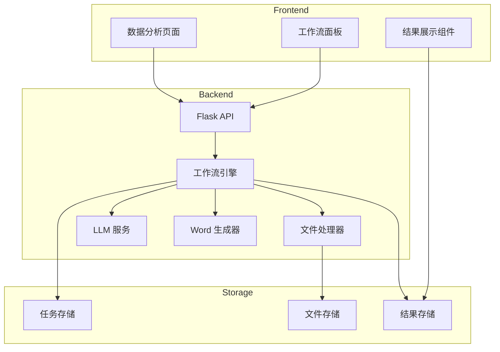
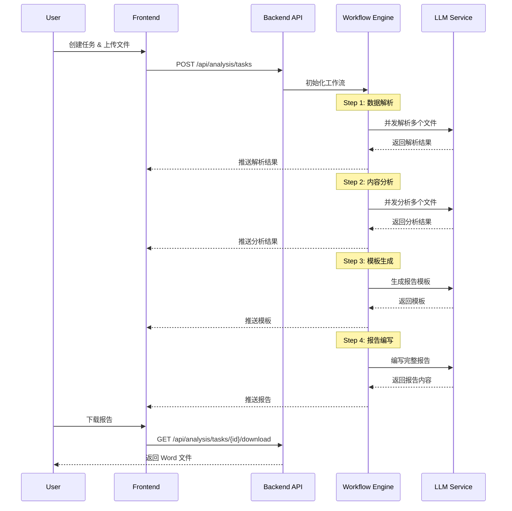

# Design Document

## Overview

数据分析模块是一个完整的 AI 驱动工作流系统，支持用户上传多个 Excel 文件，通过并发 LLM 调用完成数据解析和内容分析，最终生成专业的分析报告。系统采用工作流引擎架构，每个步骤由 LLM 执行，用户可以查看每一步的执行结果。

### Key Features
- 多文件并发上传和处理
- LLM 驱动的数据解析和内容分析
- 实时进度追踪和结果展示
- AI 生成报告模板和完整报告
- Word 文档导出

## Architecture



### Workflow Pipeline



## Components and Interfaces

### 1. Frontend Components

#### 1.1 DataAnalysisPage
主页面组件，包含任务列表和任务创建入口。

```javascript
// 页面结构
- 侧边栏：任务列表
- 主区域：
  - 任务创建表单
  - 工作流面板
  - 结果展示区
```

#### 1.2 WorkflowPanel
工作流步骤面板，显示当前进度和每个步骤的状态。

```javascript
// 步骤状态
const STEP_STATUS = {
  PENDING: 'pending',
  RUNNING: 'running',
  COMPLETED: 'completed',
  FAILED: 'failed'
};

// 工作流步骤
const WORKFLOW_STEPS = [
  { id: 'parse', name: '数据解析', description: 'LLM 解析文件结构' },
  { id: 'analyze', name: '内容分析', description: 'LLM 分析文件内容' },
  { id: 'template', name: '模板生成', description: 'LLM 生成报告模板' },
  { id: 'report', name: '报告编写', description: 'LLM 编写完整报告' }
];
```

#### 1.3 FileResultCard
单个文件的结果展示卡片，支持展开/折叠查看详细结果。

### 2. Backend API

#### 2.1 Task Management API

```python
# 创建任务
POST /api/analysis/tasks
Request: { name: string, description: string }
Response: { task_id: string, created_at: string }

# 获取任务列表
GET /api/analysis/tasks
Response: [{ task_id, name, status, created_at, updated_at }]

# 获取任务详情
GET /api/analysis/tasks/{task_id}
Response: { task_id, name, status, files, workflow_state, results }

# 删除任务
DELETE /api/analysis/tasks/{task_id}
Response: { success: boolean }
```

#### 2.2 File Upload API

```python
# 上传文件
POST /api/analysis/tasks/{task_id}/files
Request: multipart/form-data (files[])
Response: { files: [{ file_id, filename, size, status }] }

# 获取文件列表
GET /api/analysis/tasks/{task_id}/files
Response: [{ file_id, filename, size, status, parse_result, analysis_result }]
```

#### 2.3 Workflow API

```python
# 启动工作流
POST /api/analysis/tasks/{task_id}/workflow/start
Response: { status: 'started', current_step: 'parse' }

# 获取工作流状态
GET /api/analysis/tasks/{task_id}/workflow/status
Response: { 
  current_step: string,
  steps: [{ id, status, started_at, completed_at, result }],
  files_progress: [{ file_id, filename, step_status }]
}

# 重试失败步骤
POST /api/analysis/tasks/{task_id}/workflow/retry
Request: { step_id: string, file_id?: string }
Response: { status: 'retrying' }
```

#### 2.4 Report API

```python
# 获取报告预览
GET /api/analysis/tasks/{task_id}/report
Response: { template: object, content: string, generated_at: string }

# 下载 Word 报告
GET /api/analysis/tasks/{task_id}/download
Response: application/vnd.openxmlformats-officedocument.wordprocessingml.document
```

### 3. LLM Service Interface

```python
class LLMService:
    def parse_file(self, file_data: dict) -> dict:
        """解析单个文件的结构和内容"""
        pass
    
    def analyze_content(self, parsed_data: dict) -> dict:
        """分析文件内容，提取洞察"""
        pass
    
    def generate_template(self, all_analyses: list) -> dict:
        """根据所有分析结果生成报告模板"""
        pass
    
    def write_report(self, template: dict, all_analyses: list) -> str:
        """根据模板编写完整报告"""
        pass
```

## Data Models

### Task Model

```python
{
    "task_id": "string",           # 唯一标识
    "name": "string",              # 任务名称
    "description": "string",       # 任务描述
    "status": "string",            # pending | running | completed | failed
    "created_at": "datetime",
    "updated_at": "datetime",
    "files": [FileModel],
    "workflow_state": WorkflowState,
    "results": {
        "parse": {},
        "analyze": {},
        "template": {},
        "report": {}
    }
}
```

### File Model

```python
{
    "file_id": "string",
    "filename": "string",
    "size": "number",
    "upload_time": "datetime",
    "status": "string",            # uploaded | parsing | parsed | analyzing | analyzed | failed
    "parse_result": {
        "columns": [],
        "row_count": "number",
        "summary": "string",
        "structured_data": []
    },
    "analysis_result": {
        "key_findings": [],
        "patterns": [],
        "statistics": {},
        "insights": "string"
    }
}
```

### Workflow State Model

```python
{
    "current_step": "string",
    "steps": [
        {
            "id": "string",
            "status": "string",
            "started_at": "datetime",
            "completed_at": "datetime",
            "error": "string"
        }
    ],
    "files_progress": {
        "file_id": {
            "parse": "status",
            "analyze": "status"
        }
    }
}
```


## Correctness Properties

*A property is a characteristic or behavior that should hold true across all valid executions of a system-essentially, a formal statement about what the system should do. Properties serve as the bridge between human-readable specifications and machine-verifiable correctness guarantees.*

Based on the prework analysis, the following correctness properties have been identified:

### Property 1: Task ID Uniqueness
*For any* number of task creation requests, each generated task_id SHALL be unique across all tasks in the system.
**Validates: Requirements 1.2**

### Property 2: File Validation Consistency
*For any* file upload request, the system SHALL correctly validate file format (xlsx only) and size constraints (≤ 10MB per file, ≤ 10 files per task), rejecting invalid files and accepting valid ones.
**Validates: Requirements 1.3, 1.5**

### Property 3: File-Task Association Integrity
*For any* successfully uploaded files, all files SHALL be correctly associated with their task_id and retrievable via the task's file list.
**Validates: Requirements 1.4**

### Property 4: Concurrent Processing Completeness
*For any* set of uploaded files in a task, when concurrent processing is triggered, all files SHALL be processed and each file SHALL have its own result.
**Validates: Requirements 2.2, 3.1**

### Property 5: Structured Output Format
*For any* file that completes parsing or analysis, the result SHALL contain all required fields (columns, row_count, summary for parsing; key_findings, patterns, statistics for analysis).
**Validates: Requirements 2.3, 3.2, 3.3**

### Property 6: Workflow Step Progression
*For any* workflow execution, when all files complete the current step, the next step SHALL be enabled; the workflow SHALL progress through steps in order (parse → analyze → template → report).
**Validates: Requirements 2.5, 3.5, 4.5**

### Property 7: Template Structure Completeness
*For any* generated report template, it SHALL contain sections, headings, and content placeholders based on the analysis results.
**Validates: Requirements 4.2, 4.3**

### Property 8: Report Content Coverage
*For any* generated report, it SHALL cover all sections defined in the template with detailed content.
**Validates: Requirements 5.2, 5.4**

### Property 9: Word Document Format Validity
*For any* generated Word document, it SHALL be a valid .docx file with proper formatting (headings, paragraphs, tables).
**Validates: Requirements 6.1, 6.3**

### Property 10: Workflow Progress State Consistency
*For any* running workflow, the displayed progress SHALL accurately reflect the current step, completed steps, pending steps, and per-file status.
**Validates: Requirements 7.1, 7.2, 7.3**

### Property 11: Task List Display Completeness
*For any* user with existing tasks, all tasks SHALL be displayed in the task list with their current workflow status.
**Validates: Requirements 8.4**

## Error Handling

### File Upload Errors
- Invalid file format: Display error message with allowed formats (.xlsx)
- File too large: Display error message with size limit (10MB)
- Too many files: Display error message with file count limit (10)
- Upload failure: Allow retry for failed files

### LLM Processing Errors
- LLM timeout: Retry up to 3 times with exponential backoff
- LLM response parsing error: Log error and retry
- LLM service unavailable: Display service error and allow manual retry

### Workflow Errors
- Step failure: Mark step as failed, allow retry from failed step
- File processing failure: Mark file as failed, allow retry for specific file
- Partial completion: Save completed results, allow resume

### Word Generation Errors
- Conversion failure: Display error and allow retry
- Template rendering error: Fall back to basic formatting

## Testing Strategy

### Unit Testing
- Test file validation logic (format, size, count)
- Test task CRUD operations
- Test workflow state transitions
- Test Word document generation

### Property-Based Testing
Using `hypothesis` library for Python:

- **Property 1**: Generate random task creation requests, verify all task_ids are unique
- **Property 2**: Generate random files with various formats and sizes, verify validation correctness
- **Property 3**: Generate random file uploads, verify file-task associations
- **Property 4**: Generate random file sets, verify all files are processed
- **Property 5**: Generate random parsed/analyzed results, verify required fields presence
- **Property 6**: Generate random workflow states, verify step progression logic
- **Property 7**: Generate random analysis results, verify template structure
- **Property 8**: Generate random templates, verify report coverage
- **Property 9**: Generate random report content, verify Word document validity
- **Property 10**: Generate random workflow states, verify progress display accuracy
- **Property 11**: Generate random task sets, verify task list completeness

### Integration Testing
- End-to-end workflow execution with sample files
- LLM service integration tests
- Word export functionality tests

### Test Configuration
- Property-based tests: minimum 100 iterations per property
- Each property test tagged with: `**Feature: data-analysis, Property {number}: {property_text}**`
