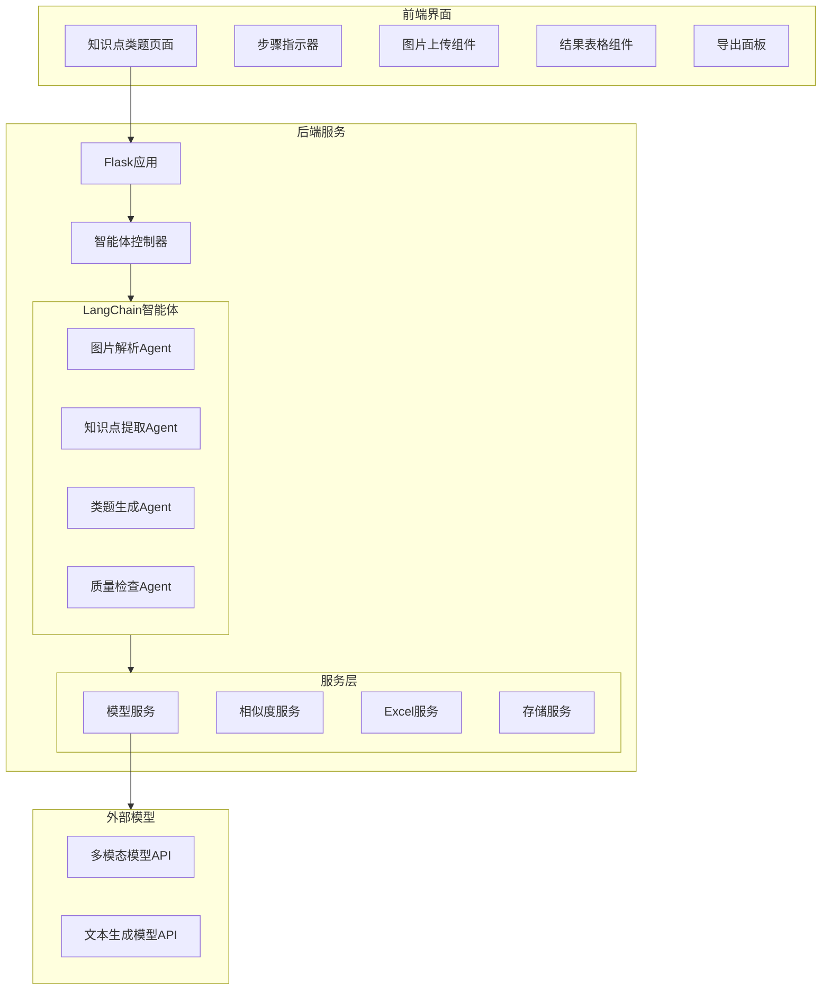

# Design Document

## Overview

本系统是一个基于LangChain的智能体，用于从作业图片中提取知识点并生成高质量类题。系统采用多步骤工作流设计，通过多模态大模型解析图片内容，提取题目的知识点和详细解析，然后利用用户选择的文本生成模型根据知识点解析生成类似题目。

### 核心功能
1. 批量图片上传与预览
2. 多模态模型解析题目内容
3. 知识点提取与层级构建
4. 语义相似度去重
5. 类题生成与质量控制
6. 多格式Excel导出

### 技术栈
- 后端：Python + Flask + LangChain
- 前端：HTML + CSS + JavaScript
- 数据存储：JSON文件 + Excel导出
- AI模型：多模态模型（可选）+ 文本生成模型（可选）

## Architecture



## Components and Interfaces

### 1. Flask路由接口

```python
# 页面路由
GET /knowledge-agent              # 知识点类题页面

# API路由
POST /api/knowledge-agent/upload  # 上传图片
POST /api/knowledge-agent/parse   # 解析图片
POST /api/knowledge-agent/dedupe  # 知识点去重
POST /api/knowledge-agent/generate # 生成类题
POST /api/knowledge-agent/regenerate # 重新生成单个类题
GET  /api/knowledge-agent/export/<type> # 导出Excel
GET  /api/knowledge-agent/models  # 获取可用模型列表
POST /api/knowledge-agent/models/select # 选择模型
GET  /api/knowledge-agent/task/<task_id> # 获取任务状态
```

### 2. 数据模型接口

```python
from dataclasses import dataclass
from typing import List, Optional
from enum import Enum

class DifficultyLevel(Enum):
    EASY = "简单"
    MEDIUM = "中等"
    HARD = "困难"

class QuestionType(Enum):
    CHOICE = "选择题"
    FILL_BLANK = "填空题"
    CALCULATION = "计算题"
    PROOF = "证明题"
    SHORT_ANSWER = "简答题"

@dataclass
class KnowledgePoint:
    id: str
    primary: str           # 一级知识点（≤20字符）
    secondary: str         # 二级知识点
    analysis: str          # 知识点解析（详细）
    
@dataclass
class ParsedQuestion:
    id: str
    image_source: str      # 图片来源
    content: str           # 题目内容
    subject: str           # 学科分类
    question_type: QuestionType
    difficulty: DifficultyLevel
    knowledge_points: List[KnowledgePoint]

@dataclass
class SimilarQuestion:
    id: str
    knowledge_point_id: str
    content: str           # 类题内容
    answer: str            # 标准答案
    solution_steps: str    # 解题步骤
    difficulty: DifficultyLevel
    question_type: QuestionType

@dataclass
class DedupeResult:
    original_point: str
    merged_point: str
    similarity_score: float
    is_merged: bool

@dataclass
class TaskProgress:
    task_id: str
    current_step: int
    total_steps: int
    status: str            # pending, processing, completed, error
    message: str
    progress_percent: float
```

### 3. LangChain Agent接口

```python
from langchain.agents import AgentExecutor
from langchain.tools import BaseTool

class ImageParserTool(BaseTool):
    """解析图片内容，提取题目信息"""
    name: str = "image_parser"
    description: str = "解析作业图片，识别题目内容"
    
    def _run(self, image_path: str, model_name: str) -> ParsedQuestion:
        pass

class KnowledgeExtractorTool(BaseTool):
    """从题目中提取知识点"""
    name: str = "knowledge_extractor"
    description: str = "从题目内容中提取知识点和解析"
    
    def _run(self, question_content: str, model_name: str) -> List[KnowledgePoint]:
        pass

class QuestionGeneratorTool(BaseTool):
    """根据知识点生成类题"""
    name: str = "question_generator"
    description: str = "根据知识点解析生成类似题目"
    
    def _run(self, knowledge_analysis: str, difficulty: str, 
             question_type: str, model_name: str, count: int = 1) -> List[SimilarQuestion]:
        pass

class HomeworkAgent:
    """作业知识点智能体"""
    
    def __init__(self, multimodal_model: str, text_model: str):
        self.multimodal_model = multimodal_model
        self.text_model = text_model
        self.tools = [ImageParserTool(), KnowledgeExtractorTool(), QuestionGeneratorTool()]
        self.agent = self._create_agent()
    
    def parse_images(self, image_paths: List[str]) -> List[ParsedQuestion]:
        """批量解析图片"""
        pass
    
    def dedupe_knowledge_points(self, questions: List[ParsedQuestion], 
                                 threshold: float = 0.85) -> List[DedupeResult]:
        """知识点去重"""
        pass
    
    def generate_similar_questions(self, knowledge_points: List[KnowledgePoint],
                                    count_per_point: int = 1) -> List[SimilarQuestion]:
        """生成类题"""
        pass
```

### 4. 服务层接口

```python
class ModelService:
    """模型服务"""
    
    def get_available_models(self) -> dict:
        """获取可用模型列表"""
        return {
            "multimodal": [
                {"name": "doubao-1-5-vision-pro-32k-250115", "provider": "豆包", "desc": "Vision Pro"},
                {"name": "qwen-vl-plus", "provider": "阿里云", "desc": "Qwen VL"},
                {"name": "gpt-4-vision-preview", "provider": "OpenAI", "desc": "GPT-4V"}
            ],
            "text_generation": [
                {"name": "deepseek-v3.2", "provider": "DeepSeek", "desc": "DeepSeek V3.2"},
                {"name": "gpt-5-chat-latest", "provider": "OpenAI", "desc": "GPT-5 Chat"},
                {"name": "qwen-max", "provider": "阿里云", "desc": "Qwen Max"}
            ]
        }
    
    def call_multimodal(self, model_name: str, image_base64: str, prompt: str) -> str:
        """调用多模态模型"""
        pass
    
    def call_text_generation(self, model_name: str, prompt: str) -> str:
        """调用文本生成模型"""
        pass

class SimilarityService:
    """相似度服务"""
    
    def calculate_similarity(self, text1: str, text2: str) -> float:
        """计算两个文本的语义相似度"""
        pass
    
    def find_duplicates(self, knowledge_points: List[str], 
                        threshold: float = 0.85) -> List[DedupeResult]:
        """查找重复知识点"""
        pass

class ExcelService:
    """Excel导出服务"""
    
    def export_parse_result(self, questions: List[ParsedQuestion]) -> str:
        """导出解析结果Excel"""
        pass
    
    def export_similar_questions(self, questions: List[SimilarQuestion]) -> str:
        """导出类题结果Excel"""
        pass
    
    def export_full_result(self, parsed: List[ParsedQuestion], 
                           similar: List[SimilarQuestion]) -> str:
        """导出完整结果Excel"""
        pass
```

## Data Models

### 任务数据结构 (JSON)

```json
{
  "task_id": "uuid",
  "created_at": "2026-01-06T10:00:00Z",
  "status": "completed",
  "config": {
    "multimodal_model": "doubao-1-5-vision-pro-32k-250115",
    "text_model": "deepseek-v3.2",
    "similarity_threshold": 0.85,
    "questions_per_point": 1
  },
  "images": [
    {"id": "img1", "filename": "homework1.jpg", "path": "/uploads/xxx.jpg"}
  ],
  "parsed_questions": [
    {
      "id": "q1",
      "image_source": "img1",
      "content": "计算 2x + 3 = 7 中 x 的值",
      "subject": "数学",
      "question_type": "计算题",
      "difficulty": "简单",
      "knowledge_points": [
        {
          "id": "kp1",
          "primary": "一元一次方程",
          "secondary": "移项与合并同类项",
          "analysis": "一元一次方程的解法：1. 移项：将含未知数的项移到等号左边，常数项移到右边；2. 合并同类项；3. 系数化为1。本题中，先将3移到右边得2x=4，再除以2得x=2。"
        }
      ]
    }
  ],
  "dedupe_results": [
    {
      "original_point": "一元一次方程",
      "merged_point": "一元一次方程",
      "similarity_score": 1.0,
      "is_merged": false
    }
  ],
  "similar_questions": [
    {
      "id": "sq1",
      "knowledge_point_id": "kp1",
      "content": "解方程：3x - 5 = 10",
      "answer": "x = 5",
      "solution_steps": "1. 移项：3x = 10 + 5 = 15\n2. 系数化为1：x = 15 ÷ 3 = 5",
      "difficulty": "简单",
      "question_type": "计算题"
    }
  ]
}
```

### Excel导出格式

#### 解析结果Excel
| 序号 | 图片来源 | 题目内容 | 学科分类 | 题目类型 | 难度等级 | 一级知识点 | 二级知识点 | 知识点解析 |
|------|----------|----------|----------|----------|----------|------------|------------|------------|

#### 类题结果Excel
| 序号 | 知识点 | 知识点解析 | 类题内容 | 类题答案 | 解题步骤 | 难度等级 | 题目类型 |
|------|--------|------------|----------|----------|----------|----------|----------|

#### 完整结果Excel
| 序号 | 图片来源 | 原题内容 | 学科分类 | 题目类型 | 难度等级 | 一级知识点 | 二级知识点 | 知识点解析 | 类题内容 | 类题答案 | 解题步骤 |
|------|----------|----------|----------|----------|----------|------------|------------|------------|----------|----------|----------|


## Correctness Properties

*A property is a characteristic or behavior that should hold true across all valid executions of a system-essentially, a formal statement about what the system should do. 
Properties serve as the bridge between human-readable specifications and machine-verifiable correctness guarantees.*

### Property 1: Image Upload Validation
*For any* uploaded file, if the file format is not JPG/PNG/JPEG, the system should reject the upload and return a format error.
**Validates: Requirements 1.2**

### Property 2: Knowledge Point Length Constraint
*For any* extracted knowledge point, the primary knowledge point text should not exceed 20 characters.
**Validates: Requirements 2.3**

### Property 3: Parsed Question Structure Completeness
*For any* parsed question result, the output should contain valid subject category, question type, and difficulty level from the defined enums.
**Validates: Requirements 2.6, 2.7**

### Property 4: Knowledge Hierarchy Structure
*For any* question with multiple knowledge points, each knowledge point should have both primary (一级) and secondary (二级) fields populated.
**Validates: Requirements 2.8**

### Property 5: Knowledge Point Deduplication
*For any* list of knowledge points with duplicates (similarity > threshold), the deduplicated list should have fewer or equal items, and no two remaining items should have similarity above the threshold.
**Validates: Requirements 3.2**

### Property 6: Similar Question Attribute Preservation
*For any* generated similar question, the difficulty level and question type should match the original question's attributes.
**Validates: Requirements 3.5, 3.6**

### Property 7: Similar Question Output Completeness
*For any* generated similar question, the output should contain non-empty content, answer, and solution_steps fields.
**Validates: Requirements 3.7**

### Property 8: Question Generation Count Constraint
*For any* knowledge point with specified generation count n (1 ≤ n ≤ 5), the system should generate exactly n similar questions for that knowledge point.
**Validates: Requirements 3.8**

### Property 9: Data Serialization Round-Trip
*For any* valid task data structure, serializing to JSON and then deserializing should produce an equivalent data structure.
**Validates: Requirements 5.3**

### Property 10: Excel Export Column Completeness
*For any* Excel export operation, the exported file should contain all required columns as specified for that export type (parse result, similar questions, or full result).
**Validates: Requirements 2.9, 3.9, 4.2**

### Property 11: Similarity Threshold Consistency
*For any* pair of knowledge points, if their similarity score exceeds the threshold, they should be marked as duplicates; if below, they should not be marked as duplicates.
**Validates: Requirements 8.1, 8.2**

### Property 12: Model Preference Persistence
*For any* user model selection, saving and then loading the preference should return the same model configuration.
**Validates: Requirements 9.3, 9.4**

### Property 13: User Edit Persistence
*For any* user edit to a similar question, saving the edit and then retrieving the question should reflect the user's modifications.
**Validates: Requirements 7.5**

## Error Handling

### 错误类型定义

```python
class AgentError(Exception):
    """智能体基础错误"""
    pass

class ImageUploadError(AgentError):
    """图片上传错误"""
    INVALID_FORMAT = "invalid_format"
    SIZE_EXCEEDED = "size_exceeded"
    UPLOAD_FAILED = "upload_failed"

class ModelError(AgentError):
    """模型调用错误"""
    API_ERROR = "api_error"
    TIMEOUT = "timeout"
    RATE_LIMIT = "rate_limit"
    INVALID_RESPONSE = "invalid_response"

class ParseError(AgentError):
    """解析错误"""
    EMPTY_CONTENT = "empty_content"
    INVALID_STRUCTURE = "invalid_structure"

class ExportError(AgentError):
    """导出错误"""
    FILE_WRITE_FAILED = "file_write_failed"
    INVALID_DATA = "invalid_data"
```

### 错误处理策略

1. **图片上传错误**：返回具体错误信息，允许用户重新上传
2. **模型调用错误**：提示用户切换模型或重试，支持自动重试3次
3. **解析错误**：标记该图片解析失败，继续处理其他图片
4. **导出错误**：显示错误信息，允许重新导出

## Testing Strategy

### 单元测试

使用 pytest 进行单元测试：

1. **数据模型测试**
   - 测试 ParsedQuestion、KnowledgePoint、SimilarQuestion 的创建和验证
   - 测试枚举类型的有效值

2. **服务层测试**
   - 测试 SimilarityService 的相似度计算
   - 测试 ExcelService 的导出功能
   - 测试 StorageService 的读写操作

3. **工具测试**
   - 测试图片格式验证
   - 测试文件大小验证

### 属性测试

使用 hypothesis 库进行属性测试：

```python
from hypothesis import given, strategies as st

# 配置：每个属性测试运行至少100次迭代
settings(max_examples=100)
```

测试策略：
- 为每个数据模型创建生成器
- 测试所有正确性属性
- 重点测试边界条件和约束验证

### 测试标注格式

每个属性测试必须使用以下格式标注：
```python
# **Feature: homework-knowledge-agent, Property {number}: {property_text}**
```
