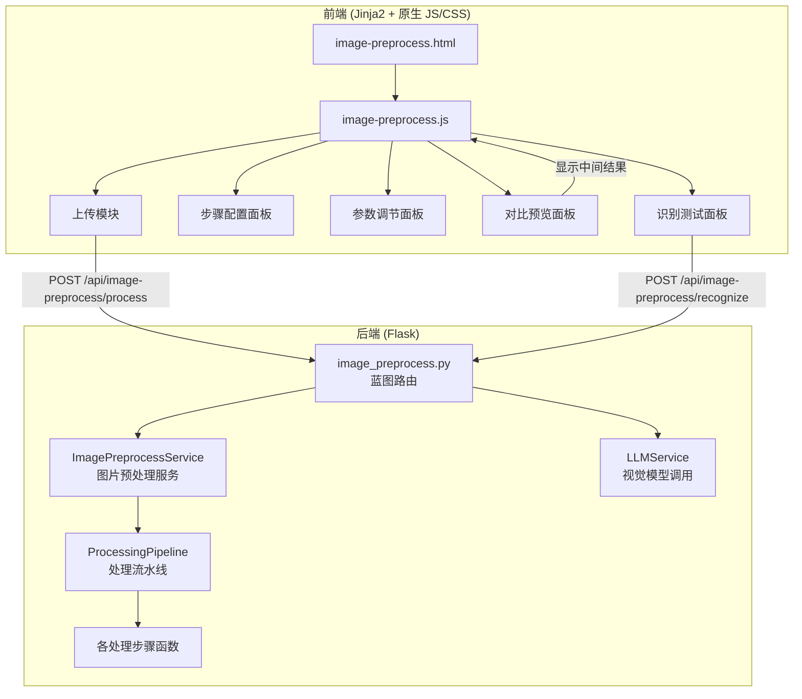
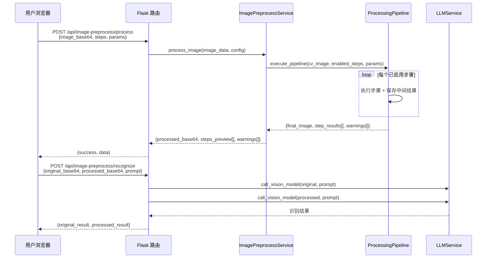

# 设计文档：作业图片预处理工具

## 概述

作业图片预处理工具为 AI 批改效果分析平台提供独立的图片处理页面，通过 OpenCV 图像处理流水线对作业图片进行多步骤预处理，提升豆包视觉 LLM 的识别准确率。系统采用后端处理 + 前端预览的架构，支持步骤可配置、参数可调节、中间结果可查看，并可直接对比原图与处理后图片的 LLM 识别效果。

## 架构



### 请求流程



## 组件与接口

### 1. 路由层：`routes/image_preprocess.py`

```python
image_preprocess_bp = Blueprint('image_preprocess', __name__)

# 页面路由
@image_preprocess_bp.route('/image-preprocess')
def image_preprocess_page():
    """渲染图片预处理工具页面"""
    return render_template('image-preprocess.html')

# API 路由
@image_preprocess_bp.route('/api/image-preprocess/process', methods=['POST'])
def process_image():
    """
    图片预处理 API
    请求体:
    {
        "image": "base64编码的图片数据",
        "steps": {
            "super_resolution": true,
            "grayscale": true,
            "denoise": true,
            "contrast": true,
            "deskew": true,
            "binarize": true,
            "crop": true
        },
        "params": {
            "super_resolution": {"scale": 2, "sharpen_strength": 0.5},
            "denoise": {"kernel_size": 5},
            "contrast": {"clip_limit": 2.0, "tile_grid_size": 8},
            "binarize": {"block_size": 11, "constant_c": 2}
        }
    }
    返回:
    {
        "success": true,
        "data": {
            "processed_image": "base64...",
            "step_results": [
                {"step": "grayscale", "label": "灰度转换", "image": "base64..."},
                {"step": "denoise", "label": "去噪", "image": "base64..."},
                ...
            ],
            "warnings": ["倾斜矫正: 未检测到明显倾斜，已跳过"]
        }
    }
    """

@image_preprocess_bp.route('/api/image-preprocess/recognize', methods=['POST'])
def recognize_compare():
    """
    LLM 视觉识别对比 API
    请求体:
    {
        "original_image": "base64...",
        "processed_image": "base64...",
        "prompt": "请识别图片中的作业答案..."
    }
    返回:
    {
        "success": true,
        "data": {
            "original_result": "原图识别文本...",
            "processed_result": "处理后识别文本..."
        }
    }
    """
```

### 2. 服务层：`services/image_preprocess_service.py`

```python
class ImagePreprocessService:
    """图片预处理服务 - 封装 OpenCV 处理流水线"""

    # 处理步骤定义（固定执行顺序）
    STEP_ORDER = [
        'super_resolution',  # 智能高清化
        'grayscale',         # 灰度转换
        'denoise',           # 去噪
        'contrast',          # 对比度增强
        'deskew',            # 倾斜矫正
        'binarize',          # 自适应二值化
        'crop',              # 边缘裁剪
    ]

    STEP_LABELS = {
        'super_resolution': '智能高清化',
        'grayscale': '灰度转换',
        'denoise': '去噪',
        'contrast': '对比度增强',
        'deskew': '倾斜矫正',
        'binarize': '自适应二值化',
        'crop': '边缘裁剪',
    }

    # 参数默认值与范围
    DEFAULT_PARAMS = {
        'super_resolution': {'scale': 2, 'sharpen_strength': 0.5},
        'denoise': {'kernel_size': 5},
        'contrast': {'clip_limit': 2.0, 'tile_grid_size': 8},
        'binarize': {'block_size': 11, 'constant_c': 2},
    }

    PARAM_RANGES = {
        'super_resolution': {
            'scale': {'min': 2, 'max': 4, 'type': 'choice', 'choices': [2, 4]},
            'sharpen_strength': {'min': 0.0, 'max': 2.0, 'type': 'float'},
        },
        'denoise': {
            'kernel_size': {'min': 3, 'max': 15, 'type': 'odd_int'},
        },
        'contrast': {
            'clip_limit': {'min': 1.0, 'max': 10.0, 'type': 'float'},
            'tile_grid_size': {'min': 2, 'max': 16, 'type': 'int'},
        },
        'binarize': {
            'block_size': {'min': 3, 'max': 99, 'type': 'odd_int'},
            'constant_c': {'min': 0, 'max': 20, 'type': 'int'},
        },
    }

    @staticmethod
    def process_image(image_base64, steps_config, params_config):
        """
        执行图片预处理流水线
        Args:
            image_base64: base64 编码的图片
            steps_config: dict, 各步骤启用状态 {step_name: bool}
            params_config: dict, 各步骤参数 {step_name: {param: value}}
        Returns:
            {
                'processed_image': base64 编码的最终图片,
                'step_results': [{'step': str, 'label': str, 'image': base64}],
                'warnings': [str]
            }
        """

    @staticmethod
    def validate_and_fix_params(params_config):
        """
        校验并修正参数值，返回修正后的参数和修正信息列表
        Args:
            params_config: 用户提交的参数配置
        Returns:
            (fixed_params, corrections[])
        """

    @staticmethod
    def decode_base64_image(image_base64):
        """将 base64 字符串解码为 OpenCV numpy 数组"""

    @staticmethod
    def encode_image_base64(cv_image):
        """将 OpenCV numpy 数组编码为 base64 字符串（PNG 格式）"""
```

### 3. 处理步骤函数（均为 `ImagePreprocessService` 的静态方法）

```python
    @staticmethod
    def step_super_resolution(image, scale=2, sharpen_strength=0.5):
        """
        智能高清化：使用 OpenCV DNN 超分辨率（EDSR）放大图片
        回退策略：模型不可用时使用 INTER_CUBIC 插值
        放大后应用 Unsharp Mask 锐化
        """

    @staticmethod
    def step_grayscale(image):
        """灰度转换：cv2.cvtColor(image, cv2.COLOR_BGR2GRAY)"""

    @staticmethod
    def step_denoise(image, kernel_size=5):
        """去噪：cv2.GaussianBlur，kernel_size 必须为奇数"""

    @staticmethod
    def step_contrast(image, clip_limit=2.0, tile_grid_size=8):
        """对比度增强：CLAHE 自适应直方图均衡化"""

    @staticmethod
    def step_deskew(image):
        """
        倾斜矫正：
        1. Canny 边缘检测
        2. 霍夫变换检测直线
        3. 计算主要倾斜角度
        4. 仿射变换旋转矫正
        如果检测角度 < 0.5°，跳过矫正
        """

    @staticmethod
    def step_binarize(image, block_size=11, constant_c=2):
        """自适应二值化：cv2.adaptiveThreshold"""

    @staticmethod
    def step_crop(image):
        """
        边缘裁剪：
        1. 检测非白色区域的边界
        2. 添加适当的边距（10px）
        3. 裁剪图片
        """
```

### 4. 前端组件

```
templates/image-preprocess.html   # 页面模板
static/js/image-preprocess.js     # 页面逻辑
static/css/image-preprocess.css   # 页面样式
```

前端 JS 模块结构：

```javascript
// image-preprocess.js 主要函数
function initPage()              // 页面初始化
function handleImageUpload(e)    // 图片上传处理
function buildStepsConfig()      // 构建步骤配置
function buildParamsConfig()     // 构建参数配置
async function processImage()    // 调用处理 API
function renderStepResults(data) // 渲染步骤中间结果
function selectStepPreview(idx)  // 切换查看某步骤结果
async function recognizeTest()   // 调用识别对比 API
function renderRecognizeResults(data) // 渲染识别结果
```

## 数据模型

### 处理请求数据结构

```python
# 处理请求
ProcessRequest = {
    'image': str,          # base64 编码图片（必填）
    'steps': {             # 步骤启用配置（可选，默认全部启用）
        'super_resolution': bool,  # 默认 False（高清化较耗时）
        'grayscale': bool,         # 默认 True
        'denoise': bool,           # 默认 True
        'contrast': bool,          # 默认 True
        'deskew': bool,            # 默认 True
        'binarize': bool,          # 默认 True
        'crop': bool,              # 默认 True
    },
    'params': {            # 步骤参数（可选，使用默认值）
        'super_resolution': {
            'scale': int,            # 2 或 4，默认 2
            'sharpen_strength': float # 0.0-2.0，默认 0.5
        },
        'denoise': {
            'kernel_size': int       # 3-15 奇数，默认 5
        },
        'contrast': {
            'clip_limit': float,     # 1.0-10.0，默认 2.0
            'tile_grid_size': int    # 2-16，默认 8
        },
        'binarize': {
            'block_size': int,       # 3-99 奇数，默认 11
            'constant_c': int        # 0-20，默认 2
        }
    }
}

# 处理响应
ProcessResponse = {
    'success': bool,
    'data': {
        'processed_image': str,    # 最终处理结果 base64
        'step_results': [          # 各步骤中间结果
            {
                'step': str,       # 步骤标识 (如 'denoise')
                'label': str,      # 步骤中文名 (如 '去噪')
                'image': str       # 该步骤执行后的图片 base64
            }
        ],
        'warnings': [str],        # 警告信息列表
        'param_corrections': [str] # 参数修正信息列表
    }
}

# 识别对比请求
RecognizeRequest = {
    'original_image': str,   # 原始图片 base64
    'processed_image': str,  # 处理后图片 base64
    'prompt': str            # 识别提示词
}

# 识别对比响应
RecognizeResponse = {
    'success': bool,
    'data': {
        'original_result': str,   # 原图识别结果
        'processed_result': str   # 处理后识别结果
    }
}
```

### 超分辨率模型文件

```
Ai/models/EDSR_x2.pb    # EDSR 2x 放大模型 (~38MB)
Ai/models/EDSR_x4.pb    # EDSR 4x 放大模型 (~38MB)
```

模型文件不纳入 Git 版本控制，通过 Dockerfile 或启动脚本自动下载。


## 正确性属性

*正确性属性是系统在所有有效执行中都应保持为真的特征或行为——本质上是关于系统应该做什么的形式化陈述。属性是人类可读规范与机器可验证正确性保证之间的桥梁。*

### Property 1: 图片格式校验

*For any* 文件数据，如果其格式为 JPG 或 PNG，则 Image_Preprocess_Service 应接受该文件；如果其格式不是 JPG 或 PNG，则应拒绝该文件并返回格式错误提示。

**Validates: Requirements 1.1, 1.2**

### Property 2: 流水线执行顺序不变性

*For any* 有效图片和任意步骤启用配置，处理流水线返回的 step_results 数组中各步骤的顺序应严格遵循预定义的固定顺序（智能高清化 → 灰度转换 → 去噪 → 对比度增强 → 倾斜矫正 → 二值化 → 边缘裁剪），且仅包含已启用的步骤。

**Validates: Requirements 2.2, 3.2**

### Property 3: 中间结果数量与启用步骤一致

*For any* 有效图片和任意步骤启用配置（至少启用一个步骤），处理流水线返回的 step_results 数组长度应等于已启用步骤的数量，且每个 step_result 应包含非空的 base64 图片数据。

**Validates: Requirements 2.3**

### Property 4: 处理流水线幂等性

*For any* 有效图片和任意固定的步骤配置与参数配置，对同一张图片执行两次处理流水线，两次返回的 processed_image 应完全相同（字节级一致）。

**Validates: Requirements 7.1**

### Property 5: 参数范围校验与修正

*For any* 参数值超出有效范围的配置，validate_and_fix_params 应将每个越界参数修正为最近的有效值（对于 odd_int 类型还需确保为奇数），且修正后的参数值应在有效范围内。

**Validates: Requirements 8.6**

### Property 6: 超分辨率尺寸不变量

*For any* 有效图片，执行 step_super_resolution 后输出图片的宽度和高度应分别为输入图片宽度和高度的 scale 倍（scale 为 2 或 4）。

**Validates: Requirements 9.1**

### Property 7: 流水线容错性

*For any* 有效图片，即使某个处理步骤内部抛出异常，处理流水线仍应返回成功结果（可能跳过失败步骤），且 warnings 列表中应包含失败步骤的警告信息。

**Validates: Requirements 2.4**

## 错误处理

| 错误场景 | 处理策略 | 用户提示 |
|----------|----------|----------|
| 上传文件格式不支持 | 前端校验 + 后端校验，拒绝请求 | "仅支持 JPG/PNG 格式图片" |
| 上传文件超过 10MB | 前端校验 + 后端校验，拒绝请求 | "文件大小不能超过 10MB" |
| base64 解码失败 | 返回 400 错误 | "图片数据无效，请重新上传" |
| 单个处理步骤异常 | 跳过该步骤，记录警告，继续后续步骤 | 在 warnings 中标注 "[步骤名]: 处理失败，已跳过" |
| 超分辨率模型缺失 | 回退到 INTER_CUBIC 插值 | 在 warnings 中标注 "智能高清化: 模型不可用，已使用双三次插值替代" |
| LLM 视觉模型调用超时 | 返回超时错误，允许重试 | "识别请求超时，请稍后重试" |
| LLM 视觉模型调用失败 | 返回具体错误信息 | "识别失败: [具体错误]" |
| 参数值越界 | 自动修正到最近有效值 | 在 param_corrections 中标注修正详情 |
| 所有步骤均禁用 | 返回原图 | "未启用任何处理步骤，返回原始图片" |

## 测试策略

### 属性测试（Property-Based Testing）

使用 `hypothesis` 库进行属性测试，每个属性测试至少运行 100 次迭代。

| 属性 | 测试方法 | 生成器 |
|------|----------|--------|
| Property 1: 格式校验 | 生成随机有效/无效图片数据，验证接受/拒绝行为 | `hypothesis` 生成随机字节 + 有效 PNG/JPG 头 |
| Property 2: 执行顺序 | 生成随机步骤启用组合，验证返回顺序 | `hypothesis` 生成 bool 字典子集 |
| Property 3: 结果数量 | 生成随机步骤启用组合，验证 step_results 长度 | 同上 |
| Property 4: 幂等性 | 生成随机小图片 + 随机配置，执行两次对比 | `hypothesis` 生成随机 numpy 数组作为图片 |
| Property 5: 参数修正 | 生成随机越界参数值，验证修正逻辑 | `hypothesis` 生成超出范围的 int/float |
| Property 6: 超分辨率尺寸 | 生成随机小图片，验证输出尺寸 | `hypothesis` 生成随机 numpy 数组 |
| Property 7: 容错性 | Mock 某步骤抛异常，验证流水线继续执行 | `unittest.mock.patch` + `hypothesis` |

### 单元测试

| 测试项 | 覆盖需求 |
|--------|----------|
| 各处理步骤独立执行正确性 | 需求 2 |
| base64 编解码往返一致性 | 需求 2.3 |
| 参数默认值正确应用 | 需求 8 |
| 超分辨率回退到插值 | 需求 9.3 |
| API 路由返回格式正确 | 需求 6 |
| 空步骤配置返回原图 | 错误处理 |

### 测试文件

```
Ai/tests/test_image_preprocess.py          # 单元测试
Ai/tests/test_image_preprocess_props.py    # 属性测试
```

### 属性测试标注格式

```python
# Feature: image-preprocess, Property 4: 处理流水线幂等性
@given(image=random_small_images(), config=random_step_configs())
def test_pipeline_idempotence(image, config):
    ...
```
