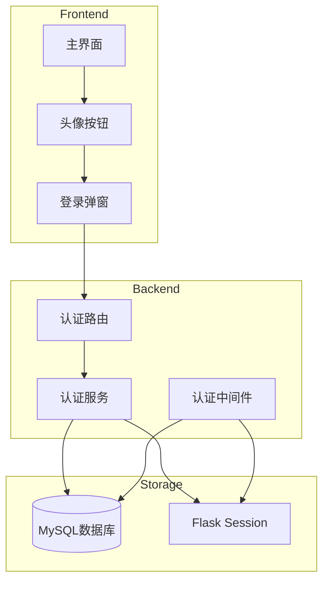

# Design Document: User Authentication System

## Overview

本设计文档描述AI批改效果分析平台的用户认证系统实现方案。系统采用Flask Session + 持久化Token的混合认证机制，支持用户登录/自动注册、记住登录状态、API密钥管理等功能。前端采用现代化的弹窗登录界面，与现有深色主题保持一致。

## Architecture



## Components and Interfaces

### 1. 数据库表结构

#### users 表
```sql
CREATE TABLE `users` (
  `id` INT UNSIGNED NOT NULL AUTO_INCREMENT,
  `username` VARCHAR(50) NOT NULL UNIQUE,
  `password_hash` VARCHAR(255) NOT NULL,
  `api_keys` JSON COMMENT 'API密钥配置',
  `remember_token` VARCHAR(64) DEFAULT NULL,
  `token_expires_at` DATETIME DEFAULT NULL,
  `created_at` DATETIME DEFAULT CURRENT_TIMESTAMP,
  `updated_at` DATETIME DEFAULT CURRENT_TIMESTAMP ON UPDATE CURRENT_TIMESTAMP,
  PRIMARY KEY (`id`),
  UNIQUE KEY `uk_username` (`username`),
  KEY `idx_remember_token` (`remember_token`)
) ENGINE=InnoDB DEFAULT CHARSET=utf8mb4;
```

#### 现有表添加 user_id 字段
- `chat_sessions`: 添加 `user_id` 字段
- `prompt_templates`: 添加 `user_id` 字段
- `knowledge_tasks`: 添加 `user_id` 字段
- `model_stats`: 添加 `user_id` 字段

### 2. 后端服务接口

#### AuthService (services/auth_service.py)
```python
class AuthService:
    @staticmethod
    def login_or_register(username: str, password: str) -> dict:
        """登录或自动注册"""
        
    @staticmethod
    def verify_password(password: str, password_hash: str) -> bool:
        """验证密码"""
        
    @staticmethod
    def hash_password(password: str) -> str:
        """密码哈希"""
        
    @staticmethod
    def create_remember_token(user_id: int) -> str:
        """创建记住登录Token"""
        
    @staticmethod
    def verify_remember_token(token: str) -> dict:
        """验证记住登录Token"""
        
    @staticmethod
    def invalidate_remember_token(user_id: int) -> None:
        """使Token失效"""
        
    @staticmethod
    def get_user_api_keys(user_id: int) -> dict:
        """获取用户API密钥"""
        
    @staticmethod
    def save_user_api_keys(user_id: int, api_keys: dict) -> None:
        """保存用户API密钥"""
```

#### 认证路由 (routes/auth.py)
```python
# POST /api/auth/login - 登录/自动注册
# POST /api/auth/logout - 登出
# GET /api/auth/status - 获取登录状态
# GET /api/auth/api-keys - 获取用户API密钥
# POST /api/auth/api-keys - 保存用户API密钥
```

#### 认证装饰器
```python
def login_required(f):
    """需要登录的路由装饰器"""
    
def get_current_user():
    """获取当前登录用户"""
```

### 3. 前端组件

#### 登录弹窗 (Login Modal)
- 居中显示的模态对话框
- 深色主题 (#212121 背景)
- 圆角设计 (16px)
- 用户名/密码输入框
- 记住登录复选框
- 登录按钮
- 点击外部或ESC关闭

#### 头像按钮 (Avatar Button)
- 位于顶部栏右侧
- 未登录：显示默认头像图标 + "登录"文字
- 已登录：显示用户名首字母圆形头像
- 点击展开下拉菜单

## Data Models

### User Model
```python
@dataclass
class User:
    id: int
    username: str
    password_hash: str
    api_keys: dict  # {doubao_key, deepseek_key, qwen_key, gpt_key}
    remember_token: Optional[str]
    token_expires_at: Optional[datetime]
    created_at: datetime
    updated_at: datetime
```

### Session Data
```python
session = {
    'user_id': int,
    'username': str,
    'logged_in': bool
}
```

### Remember Token Cookie
```
Cookie: remember_token=<64字符随机Token>
Max-Age: 30天
HttpOnly: True
SameSite: Lax
```

## Correctness Properties

*A property is a characteristic or behavior that should hold true across all valid executions of a system-essentially, a formal statement about what the system should do. Properties serve as the bridge between human-readable specifications and machine-verifiable correctness guarantees.*

### Property 1: Auto-registration creates valid user
*For any* valid username and password, if the username does not exist, submitting credentials SHALL create a new user with hashed password and return a valid session.
**Validates: Requirements 1.1**

### Property 2: Login with correct password succeeds
*For any* existing user and their correct password, login SHALL succeed and create a valid session.
**Validates: Requirements 1.2**

### Property 3: Login with wrong password fails
*For any* existing user and an incorrect password, login SHALL fail and return an error.
**Validates: Requirements 1.3**

### Property 4: Logout destroys session
*For any* logged-in user, after logout, the session SHALL be invalid and subsequent requests SHALL require re-authentication.
**Validates: Requirements 3.1**

### Property 5: Chat records are user-isolated
*For any* two different users, each user SHALL only see their own chat records when querying chat history.
**Validates: Requirements 4.2**

### Property 6: Unauthenticated requests return 401
*For any* protected API endpoint, requests without valid authentication SHALL return 401 status code.
**Validates: Requirements 6.1**

### Property 7: Password is never stored in plaintext
*For any* user created in the system, the stored password_hash SHALL NOT equal the original password.
**Validates: Requirements 5.1**

### Property 8: Remember token enables session restoration
*For any* user who logged in with "remember me", returning with a valid token SHALL restore the session without re-entering credentials.
**Validates: Requirements 8.2**

### Property 9: Logout invalidates remember token
*For any* user who logs out, their remember token SHALL become invalid for future session restoration.
**Validates: Requirements 8.4**

### Property 10: API keys are user-specific
*For any* user, saving API keys SHALL associate them with that user, and loading SHALL return only that user's keys.
**Validates: Requirements 7.1, 7.2**

### Property 11: Datasets are shared across users
*For any* dataset created by any user, all authenticated users SHALL be able to access, modify, and delete it.
**Validates: Requirements 10.1, 10.2, 10.3**

### Property 12: Prompt templates respect ownership
*For any* user-created prompt template, only the owner SHALL be able to modify or delete it.
**Validates: Requirements 11.3**

### Property 13: Knowledge tasks are user-isolated
*For any* two different users, each user SHALL only see their own knowledge agent tasks.
**Validates: Requirements 12.2**

## Error Handling

| 错误场景 | HTTP状态码 | 错误消息 |
|---------|-----------|---------|
| 用户名为空 | 400 | 请输入用户名 |
| 密码为空 | 400 | 请输入密码 |
| 密码错误 | 401 | 用户名或密码错误 |
| 未登录访问保护资源 | 401 | 请先登录 |
| Token过期 | 401 | 登录已过期，请重新登录 |
| 无权限操作 | 403 | 无权限执行此操作 |

## Testing Strategy

### 单元测试
- 密码哈希和验证函数
- Token生成和验证函数
- 用户数据模型操作

### 属性测试 (Property-Based Testing)
使用 `hypothesis` 库进行属性测试，验证系统的正确性属性。

配置：
- 每个属性测试运行至少 100 次迭代
- 使用 `@settings(max_examples=100)` 配置

测试标注格式：
```python
# **Feature: user-auth, Property 1: Auto-registration creates valid user**
@given(username=st.text(min_size=1, max_size=50), password=st.text(min_size=1, max_size=100))
def test_auto_registration_creates_valid_user(username, password):
    ...
```

### 集成测试
- 完整登录流程测试
- 记住登录功能测试
- API保护测试
- 数据隔离测试

