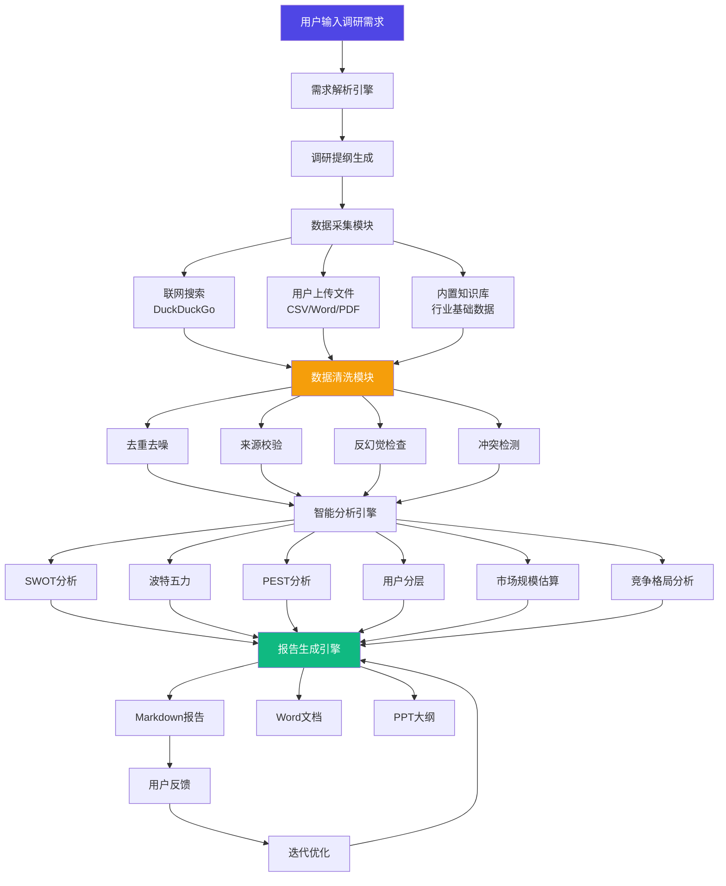

# AI调研员 (AI Research Agent) v1.0.0

> 全流程自动化行业调研智能体，覆盖「需求拆解→数据采集→清洗校验→分析洞察→报告生成」

---

## 整体架构



### 模块说明

| 模块 | 文件 | 作用 |
|------|------|------|
| 数据模型 | `models.py` | 定义调研任务全流程的数据结构 |
| 系统提示词 | `prompts.py` | 核心角色定义、反幻觉规则、各阶段提示词 |
| 服务层 | `services.py` | LLM调用、联网搜索、文件解析、数据清洗、报告生成、任务存储 |
| 分析模型 | `analysis_models.py` | SWOT/波特五力/PEST等分析框架实现及自动推荐引擎 |
| Agent引擎 | `agent.py` | 核心调研Agent，协调全流程 |
| API路由 | `routes.py` | Flask RESTful API + SSE流式接口 |
| 模块入口 | `__init__.py` | 模块初始化和导出 |

---

## 技术选型

| 组件 | 选择 | 选型理由 |
|------|------|----------|
| **LLM** | DeepSeek V3.2（默认） | 性价比高、中文能力强、API稳定 |
| **备选LLM** | GPT-5 / 豆包 Seed 1.6 | 可在界面切换，适配不同场景 |
| **联网搜索** | DuckDuckGo HTML | **免费**、无需API Key、隐私友好 |
| **备选搜索** | Bing API | 更稳定，需要API Key（付费） |
| **Web框架** | Flask Blueprint | 与主项目一致，轻量灵活 |
| **流式通信** | SSE (Server-Sent Events) | 实时进度反馈，兼容性好 |
| **文件解析** | python-docx / PyPDF2 / openpyxl | 纯Python实现，无需系统依赖 |
| **报告导出** | python-docx (Word) + Markdown | 已有依赖，无额外安装 |
| **数据存储** | JSON文件 | 轻量，无需数据库，方便迁移 |

### 不同技术水平的选择建议

- **新手用户**：使用默认配置（DeepSeek + DuckDuckGo），零配置即可运行
- **有开发能力**：可配置Bing API提升搜索质量，替换LLM为GPT-5
- **企业级部署**：可扩展接入自有知识库、私有LLM、专业数据源API

---

## 快速开始

### 1. 环境要求

```
Python >= 3.10
已有依赖：flask, requests, python-docx, openpyxl
新增依赖：PyPDF2（可选，用于PDF解析）
```

### 2. 安装依赖

```bash
pip install PyPDF2  # 可选，支持PDF文件上传
```

### 3. 配置API密钥

在项目根目录 `config.json` 中确保已配置LLM密钥：

```json
{
  "deepseek_api_key": "sk-your-deepseek-key",  // 必填（默认模型）
  "gpt_api_key": "sk-your-gpt-key",            // 可选
  "api_key": "your-doubao-key"                  // 可选
}
```

### 4. 启动服务

```bash
python app.py
```

访问 `http://localhost:5000/research-agent` 即可使用。

---

## API 接口文档

### 任务管理

| 方法 | 路径 | 说明 |
|------|------|------|
| GET | `/api/research-agent/tasks` | 获取所有任务列表 |
| POST | `/api/research-agent/tasks` | 创建新任务 |
| GET | `/api/research-agent/tasks/<id>` | 获取任务详情 |
| DELETE | `/api/research-agent/tasks/<id>` | 删除任务 |

### 调研流程

| 方法 | 路径 | 说明 |
|------|------|------|
| POST | `/api/research-agent/parse` | 解析需求生成提纲 |
| POST | `/api/research-agent/collect` | 执行数据采集 |
| POST | `/api/research-agent/upload` | 上传用户文件 |
| POST | `/api/research-agent/clean` | 数据清洗 |
| POST | `/api/research-agent/analyze` | 智能分析 |
| POST | `/api/research-agent/generate-report` | 生成报告 |
| POST | `/api/research-agent/iterate` | 迭代修改报告 |
| POST | `/api/research-agent/export` | 导出报告文件 |

### SSE流式接口

| 方法 | 路径 | 说明 |
|------|------|------|
| POST | `/api/research-agent/run-pipeline` | 全流程自动执行（SSE） |
| POST | `/api/research-agent/step-stream` | 单步骤流式执行（SSE） |

### 辅助接口

| 方法 | 路径 | 说明 |
|------|------|------|
| GET | `/api/research-agent/analysis-models` | 获取可用分析模型 |

---

## 测试用例

### 示例：2026年国内AI教育市场消费调研

**输入：**
```
调研需求：2026年国内AI应用教育市场消费调研
行业领域：AI教育
调研范围：国内市场，2024-2026年
```

**全流程调用：**
```python
from research_agent import ResearchAgent

agent = ResearchAgent()

# 创建任务
task = agent.create_task(
    query="2026年国内AI应用教育市场消费调研",
    industry="AI教育",
    scope="国内市场，2024-2026年"
)

# 执行全流程
outline = agent.parse_requirement(task)
print(f"提纲：{outline.title}，{len(outline.items)}个章节")

collected = agent.collect_data(task)
print(f"采集：{len(collected)}条数据")

cleaned = agent.clean_data(task)
print(f"清洗后：{len(cleaned)}条有效数据")

analysis = agent.run_analysis(task, ["swot", "pest", "market_size"])
print(f"分析：{len(analysis)}项结果")

report = agent.generate_report(task)
print(f"报告：{report.title}，{len(report.sections)}个章节")

# 导出
agent.export_report(task, format="markdown")
agent.export_report(task, format="word")
```

**预期输出报告片段：**

```markdown
# 2026年国内AI教育市场消费调研报告

> 生成时间：2026-03-02 | 版本：v1

## 执行摘要

中国AI教育市场正处于快速增长期。据教育部及相关行业报告显示，
2025年国内AI教育市场规模约为**XX亿元**[来源：艾瑞咨询, 2025年]，
预计2026年将达到**XX亿元**，同比增长约XX%。
⚠️ 以上数据基于公开报告推算，具体数值请参照最新发布的行业报告。

## 第一章 行业概览
### 1.1 AI教育行业定义
AI教育是指将人工智能技术应用于教育教学全过程的行业...
[来源：中国信通院《人工智能发展白皮书》, 2025年]

### 1.2 产业链分析
上游：AI算力提供商（如阿里云、华为云）、数据服务商
中游：AI教育平台和工具开发商
下游：K12学校、高校、职业教育机构、个人用户
...
```

---

## 反幻觉机制说明

AI调研员内置以下反幻觉机制：

1. **强制来源标注**：所有事实性数据必须标注原始来源（发布机构、URL、日期）
2. **可信度分级**：数据来源自动评估为高/中/低/未验证四个等级
3. **冲突检测**：不同来源的同一数据自动比对，冲突时高亮标注
4. **不确定标注**：无法确认的数据自动标注「⚠️ 暂无公开数据支撑，仅供参考」
5. **禁止虚构**：系统提示词明确禁止编造机构、数据、链接
6. **广告过滤**：自动过滤营销软文和广告内容
7. **合规检查**：遵守robots协议，不爬取付费墙内容

---

## 常见问题排查

### 1. 联网搜索失败
**现象：** DuckDuckGo搜索返回空结果  
**原因：** 网络问题或DuckDuckGo被限制  
**解决：**
- 检查服务器网络连接
- 配置Bing API Key作为备选：在`config.json`添加`"bing_api_key": "your-key"`
- 配置代理（如需要）

### 2. LLM API调用超限
**现象：** 返回429 Too Many Requests  
**解决：**
- 系统内置自动重试机制（2次）
- 降低并发请求数
- 切换到其他LLM模型
- 升级API配额

### 3. LLM返回格式错误
**现象：** JSON解析失败  
**解决：**
- 系统内置JSON提取逻辑，支持从Markdown代码块中提取
- 自动重试机制
- 如果持续失败，尝试切换LLM模型（如从doubao切到deepseek）

### 4. 文件上传解析失败
**现象：** PDF/Word解析为空  
**解决：**
- PDF需要安装`PyPDF2`：`pip install PyPDF2`
- Word需要安装`python-docx`：`pip install python-docx`（项目已包含）
- 确保文件未加密/损坏

### 5. 报告生成不完整
**现象：** 报告章节缺失  
**解决：**
- 确保前序步骤（采集、清洗、分析）已正常完成
- 增加LLM的`max_tokens`参数
- 尝试分步执行而非全流程一次性运行

---

## 迭代优化路线

### 近期可扩展
1. **多Agent协作调研**：拆分为"搜索Agent"、"分析Agent"、"写作Agent"并行工作
2. **增加数据源**：接入国家统计局API、天眼查API、上市公司财报API
3. **可视化图表**：自动生成ECharts图表嵌入报告
4. **模板库**：预设不同行业的调研模板

### 中期规划
5. **多模态数据**：支持图片/视频内容分析
6. **知识库集成**：接入企业内部知识库，支持增量更新
7. **协作功能**：多人协作编辑调研报告
8. **定时调研**：设置定时自动更新调研数据

### 长期愿景
9. **Agent网络**：与其他Agent系统互联，自动触发跨领域调研
10. **实时监控**：对关注行业进行实时数据监控和预警
11. **AI Copilot**：在报告编辑过程中提供AI辅助建议
